# Runtime state machines

## Purpose

This document makes the current lifecycle and failure transitions explicit. Refactors may redistribute these transitions among helpers or controllers, but must not change their order, timing thresholds, resource ownership, or externally reported state without a separate functional-change review.

Related contracts:

- [architecture.md](architecture.md) — component and thread ownership
- [behavior-contract.md](behavior-contract.md) — executable, stream, settings, and protocol behavior
- [time-and-coordinate-semantics.md](time-and-coordinate-semantics.md) — clock and frame invariants

## Desktop bridge state machine

### States visible to callers

`BridgeState` exposes:

- `Disconnected`
- `Connecting`
- `Streaming`
- `Stopped`

The implementation also has internal phases: connect retry, initial-frame acquisition, layout discovery/outlet initialization, frame streaming, layout reinitialization, and cleanup.

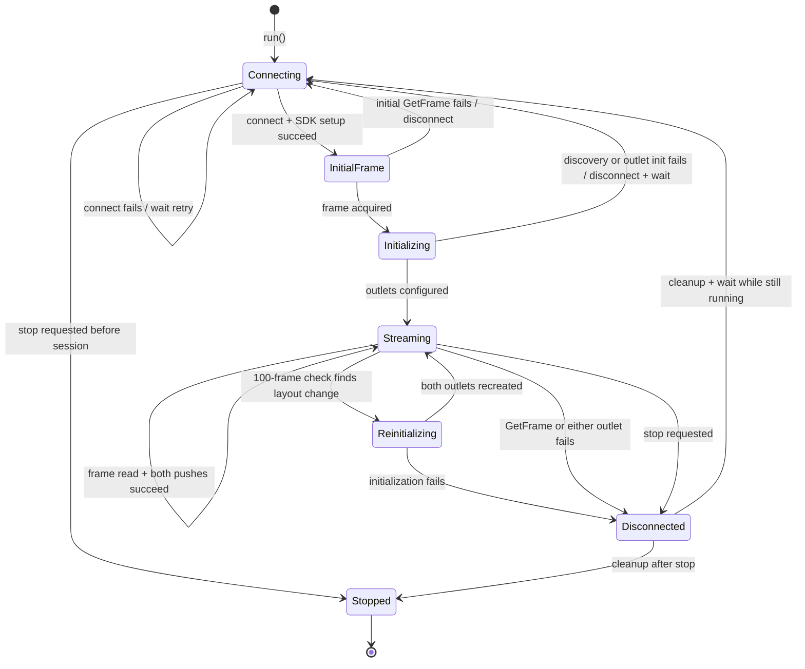

### Entry and connection rules

1. `run()` creates one `ViconTimestampState` outside the reconnect loop.
2. `connectWithRetry()` reports `Connecting` before its first attempt.
3. A failed connect reports the retry interval and waits in slices of at most 100 ms.
4. Connection success includes `SetStreamMode(ServerPush)`, `EnableSegmentData`, and `EnableMarkerData`. Failure in any setup operation disconnects the SDK client and counts as connection failure.
5. If stop is requested during connect retry, the loop exits and the final reported state is `Stopped`.

### Initial-frame and initialization rules

1. The bridge obtains an initial Vicon frame before discovery.
2. An initial `GetFrame` failure reports `Connecting`, disconnects, and restarts the outer connection loop immediately. Unlike a discovery/outlet initialization failure, this path does not explicitly call `waitForRetry()` before the next connect attempt.
3. Successful initial acquisition updates `frame_count_`.
4. Discovery is fail-fast. Any status-bearing count/name error returns an empty layout with diagnostics.
5. Initialization clears old diagnostic aggregation only after successful discovery.
6. The Vicon frame rate becomes the LSL nominal rate when positive and finite; otherwise outlets use irregular rate.
7. Hostname failure uses `default` for the source-ID suffix.
8. Marker initialization runs before segment initialization. Any thrown exception destroys both and returns failure.
9. Empty layouts are configured successfully without constructing an outlet.

### Streaming rules

For every inner-loop iteration:

1. `GetFrame` must succeed; otherwise the session exits to cleanup.
2. Candidate frame time is made finite and strictly increasing by the session-wide timestamp state. If no finite time can be selected, that frame is skipped without pushing.
3. `buildViconFrame` performs all marker and segment reads for the known layout and returns values plus diagnostics.
4. Marker push occurs before segment push, using the same timestamp.
5. Read errors or occlusions become fixed-shape invalid samples and do not stop streaming.
6. Failure of either LSL push returns false, reports a reconnect/recreate message, and exits the session.
7. Diagnostics are recorded after both push attempts.
8. After 100 processed loop iterations, the bridge resets the layout-check counter, reports streaming status, and rediscovers layout.

### Layout-check transitions

- Discovery error: diagnostics are reported, `checkLayoutChanged()` returns false, and existing streams continue.
- Same layout: streaming continues without outlet changes.
- Changed layout: both outlets are destroyed before rediscovery/initialization creates replacements.
- Reinitialization failure: streaming exits to full session cleanup.
- Reinitialization success: streaming status reports that streams were reinitialized.

### Session cleanup and final state

Cleanup order is:

1. Destroy marker outlet.
2. Destroy segment outlet.
3. Disconnect Vicon client.
4. Reset frame count, layout-check counter, known layout, diagnostics, and last diagnostic message.
5. Report `Disconnected`.
6. If still running, wait the retry interval and reconnect.
7. Otherwise report `Stopped` and return.

The timestamp monotonicity state is deliberately absent from this reset list. Stable source IDs plus a persistent timestamp guard allow a recorder to treat a recreated outlet as the same recovered stream without backwards sample time.

The bridge run flag is initialized true in the object and is not reset by `run()`. Current callers create a new bridge per GUI start; refactors must not silently make instance reuse a new supported behavior inside a structural pass.

### Bridge validation scenarios

- [ ] Stop before first connection reports `Stopped` and exits promptly.
- [ ] Repeated connection failures report retries at the configured interval.
- [ ] Setup failure disconnects before retry.
- [ ] Initial-frame failure reconnects without publishing a partial layout.
- [ ] Discovery failure discards partial names and waits before retry.
- [ ] Empty marker, empty segment, and both-empty layouts enter `Streaming` without outlets.
- [ ] Read occlusion/error publishes invalid fixed-shape data and keeps streaming.
- [ ] Outlet creation exception destroys any already-created companion outlet.
- [ ] Marker or segment push failure destroys both outlets and reconnects.
- [ ] Layout is checked at the current 100-frame cadence.
- [ ] Layout discovery error preserves existing outlets; a true change recreates both.
- [ ] Marker and segment samples share one timestamp.
- [ ] Reconnect preserves strict timestamp monotonicity for stable source IDs.
- [ ] Cleanup reports `Disconnected` before `Stopped` when a live session is stopped.

## GUI bridge worker and window state

### Worker lifecycle

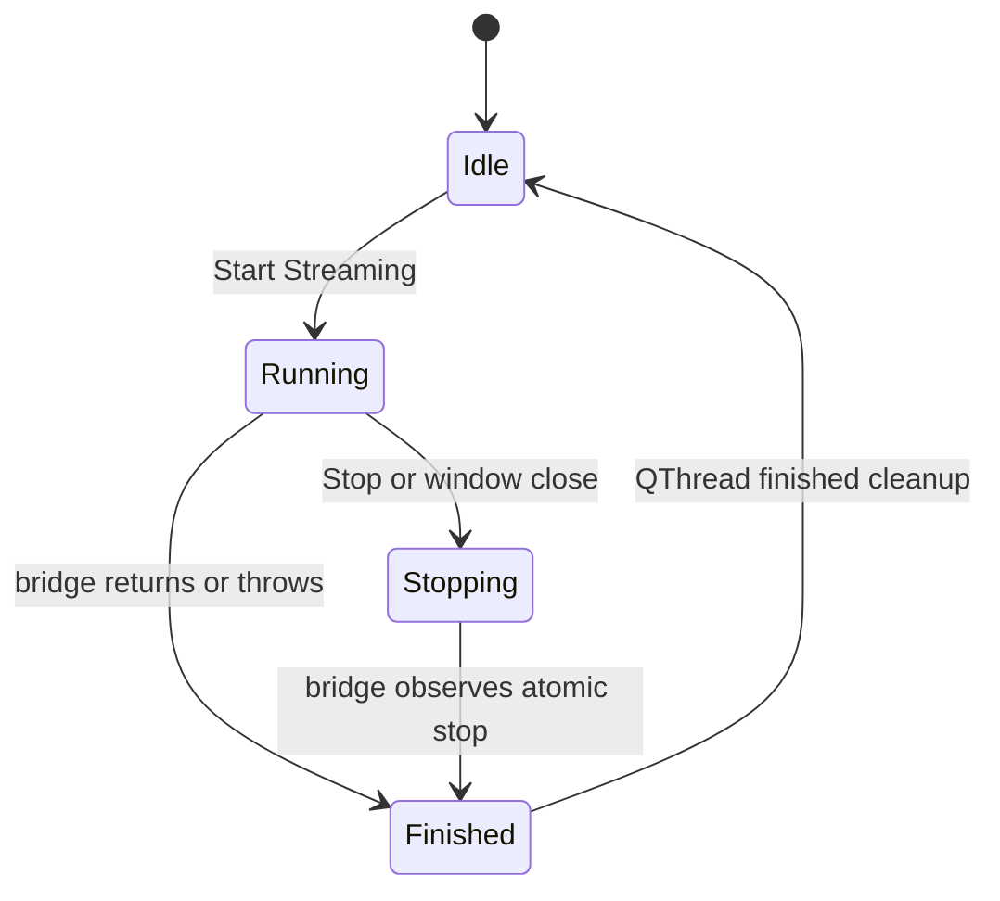

- `BridgeWindow::onStart()` snapshots the three bridge fields into `Config`, saves settings, disables those fields, constructs one `BridgeWorker`, wires signals, and starts it.
- The worker installs the status callback inside `run()` and converts bridge exceptions into a `terminal(Failed, message)` signal.
- `onStop()` disables the Stop button and requests bridge stop; it does not directly destroy the worker.
- `onWorkerFinished()` restores inputs/buttons, clears frame-rate/staleness tracking, schedules thread deletion, nulls the pointer, and allows pending close finalization.

### Status freshness

- GUI rate is derived from frame-number delta divided by elapsed GUI status time.
- The bridge normally emits periodic streaming status with the 100-frame layout-check cadence, plus transition/diagnostic statuses.
- If a streaming status has not arrived for more than 3000 ms, the GUI marks it stale once and displays `0.0 Hz`.
- A new status clears the stale flag.

## LabRecorder connection and command state machines

### Connection state

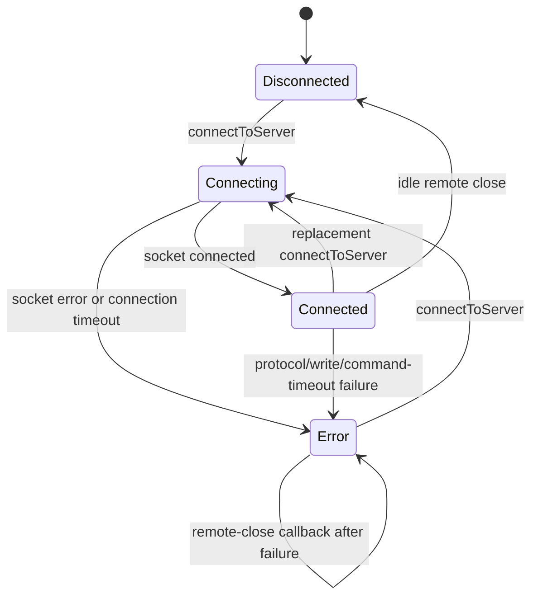

`connectToServer()` is a replacement operation, not an additive one:

1. Stop both timers.
2. Clear queued batches.
3. Fail active work as replaced, without starting another batch.
4. Clear pending write/reply buffers.
5. Abort the old socket.
6. Set connection and command timeout values independently.
7. Set recording state `Unknown`.
8. Set connection state `Connecting`, connect, and start the connection timeout if still connecting.

On a successful socket connection, state becomes `Connected` but recording remains `Unknown` until this client acknowledges Start or Stop.

### Recording state

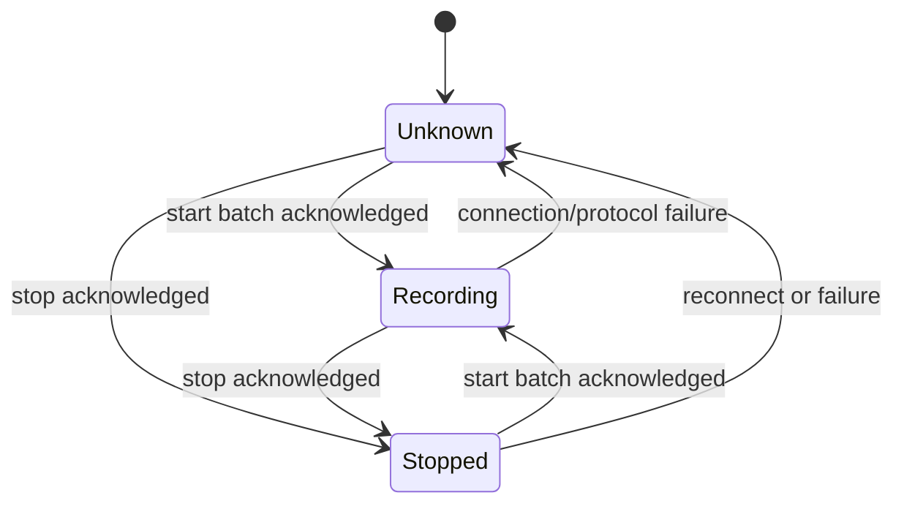

Button policy follows current enum state, not inferred recorder state:

- Refresh: connected and not `Recording`.
- Start: connected and not `Recording`, plus valid filename in the window.
- Stop: connected and not `Stopped`.

Thus Start is available when state is `Unknown`, and Stop is also available when state is `Unknown`.

### Command-batch state

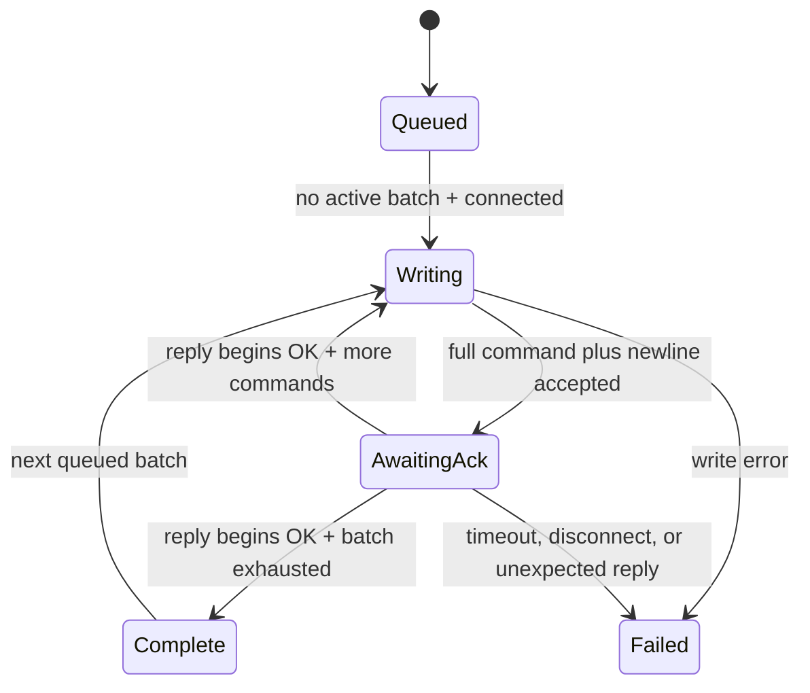

Invariants:

- Only one batch is active.
- Only one command in that batch awaits acknowledgement.
- Partial socket writes remain in `pending_payload_`.
- Reply fragments remain in `response_buffer_`.
- Leading CR, LF, space, and tab are ignored before checking for `OK`.
- Two reply bytes are sufficient to acknowledge; the protocol adapter does not wait for a full response line after `OK`.
- Failure clears later queued work and aborts the connection.
- A successful batch changes recording state only when its declared success state is not `Unknown`.

### Automatic process startup and retry

1. After window construction, a zero-delay timer calls automatic startup.
2. A valid configured executable wins; otherwise `labrecorder/LabRecorder.exe` under the application directory is selected.
3. A successfully started process is GUI owned.
4. The RCS retry timer runs every 250 ms.
5. It attempts only while the client is neither connected nor connecting.
6. At 15 seconds it stops and reports that RCS was not ready.

### LabRecorder validation scenarios

- [ ] A replacement connect fails active work and discards queued work.
- [ ] Connection timeout does not shorten the independently configured command timeout.
- [ ] Partial writes and fragmented `OK` replies advance exactly one command.
- [ ] Unexpected reply text fails the connection and reports at most the first 80 bytes.
- [ ] Start with selection sends `update`, `select all`, `filename`, `start` in order.
- [ ] Timeout or disconnect during a batch prevents later queued commands from being sent.
- [ ] Recording state becomes known only after acknowledged Start/Stop.
- [ ] Bundled executable fallback and the 15-second retry limit remain unchanged.

## Window close state machine

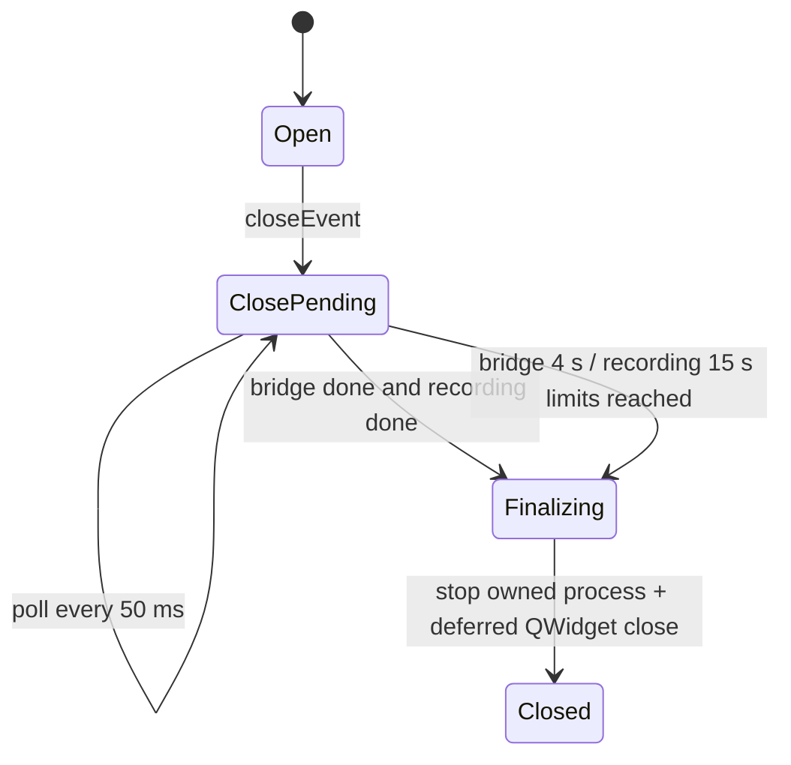

On the first close request:

- Set close pending and restart the elapsed timer.
- Request bridge stop when a worker exists.
- Queue recording Stop only when the client's recording state is exactly `Recording`.
- Start a 50 ms close poll timer.
- Ignore the immediate close event.

Readiness conditions:

- Bridge done means `worker_ == nullptr`; otherwise bridge waiting ends after 4000 ms.
- Recording done means no stop was requested or client state is `Stopped`; otherwise recording waiting ends after 15000 ms.
- When ready or timed out, the GUI stops only its owned LabRecorder process and posts a deferred final close.

Validation must cover normal acknowledgement, bridge overrun, recorder overrun, unknown recorder state, an externally owned recorder process, and repeated close events.

## Preview state machines

### Panel source state

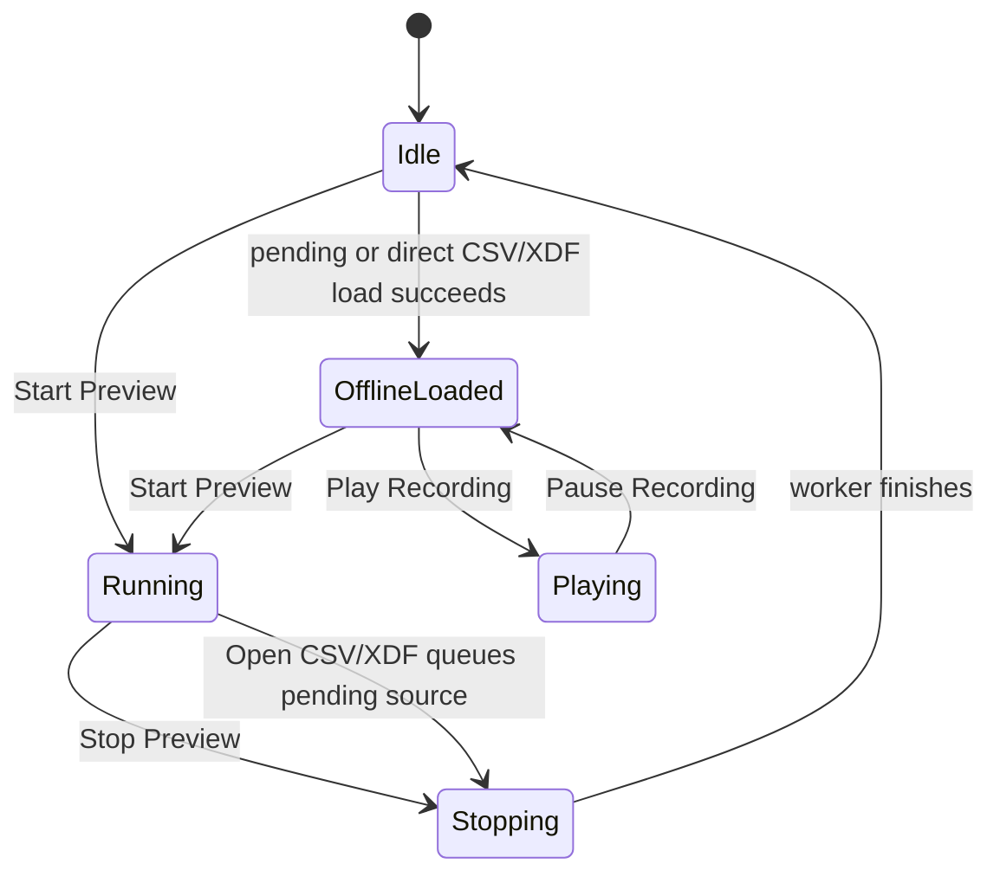

- Starting live preview stops playback, resets widget/source trails, discards session calibration, enters calibration collection, snapshots controls into `PreviewWorkerConfig`, and starts a new worker.
- Stop resets calibration to manual before requesting interruption.
- A worker that does not finish within one second remains in `Stopping`; restart and file-open buttons stay disabled until the thread actually finishes.
- Opening CSV/XDF while live sets exactly one pending source/path, requests stop, and loads only after the old worker's `finished` signal.
- CSV and XDF use the same playback storage and clock once loaded.

### Per-stream live state

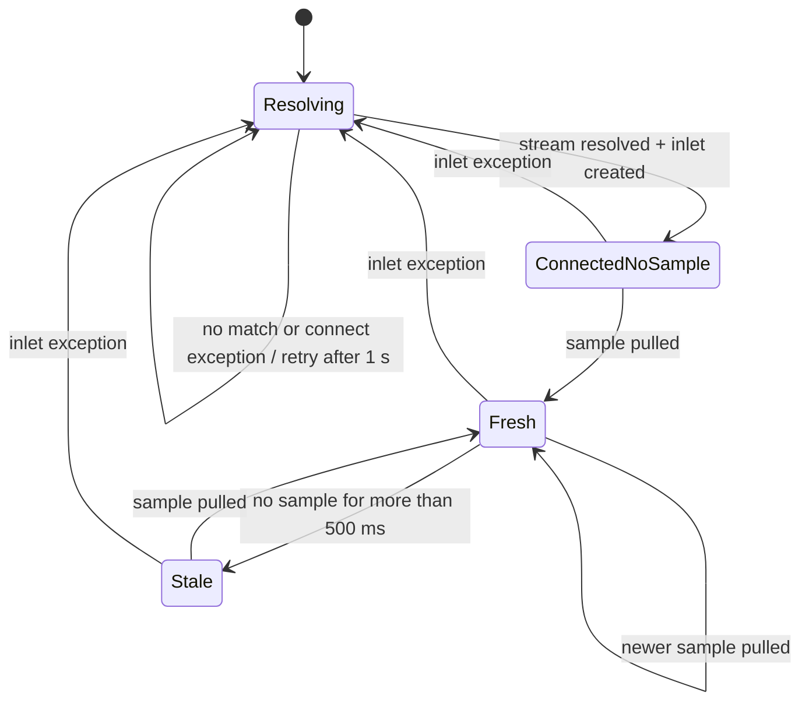

Connection status and freshness are distinct. `PreviewFrame::*_stream_present` reflects a connected inlet even when it has no sample or is stale.

### Calibration state

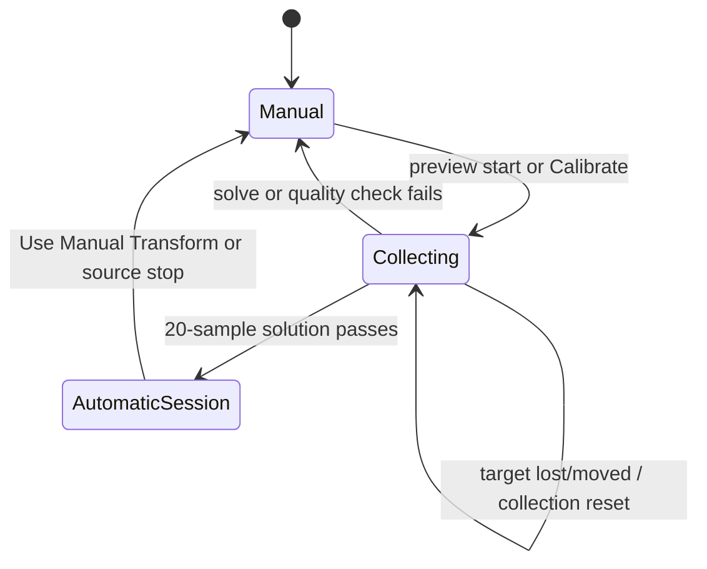

- An untracked target clears the collection.
- A pose outside tolerance from the first collected pose restarts collection with that new pose.
- The automatic transform is in-memory only and is not persisted.
- The worker receives transform changes under a mutex; the widget requests a view refit.

## HoloLens tracker/provider state machine

### Watcher and tracker lifecycle

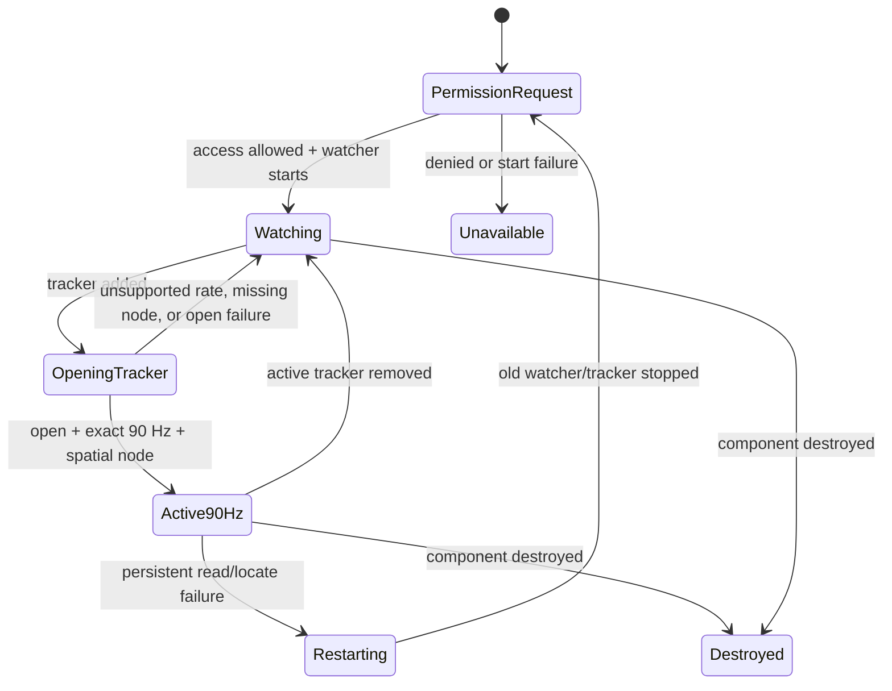

Generation counters are part of correctness:

- `watcherGeneration` rejects completion from an obsolete watcher start.
- `trackerLifecycleGeneration` rejects an `OpenAsync` continuation after removal/restart.
- `sessionGeneration` tags raw readings and tells the outlet that the active tracker session changed.
- Activating/removing/restarting a tracker resets the integer reading gate, clears both queues, and resets locate-failure counts.

### Sample pipeline state

For each publishing tick:

1. `TryGetNextSample` acquires at most one raw reading while holding the tracker gate.
2. It rejects missing, individually stale, duplicate, regressing, or invalid capture timestamps.
3. It captures available combined and optional individual-eye tracker-space rays.
4. It enqueues the raw reading under the 25 ms span and maximum-count policy.
5. Unity `Update` drains at most 32 raw readings, locates each dynamic node at the original timestamp, transforms rays, and enqueues resulting `GazeSample` values.
6. The publishing thread collapses an over-span transformed queue and dequeues the oldest retained sample.

An unsuccessful locate still produces a timestamped sample with invalid rays, unless an exception triggers tracker restart. This preserves capture cadence semantics without inventing a pose.

## HoloLens outlet state machine

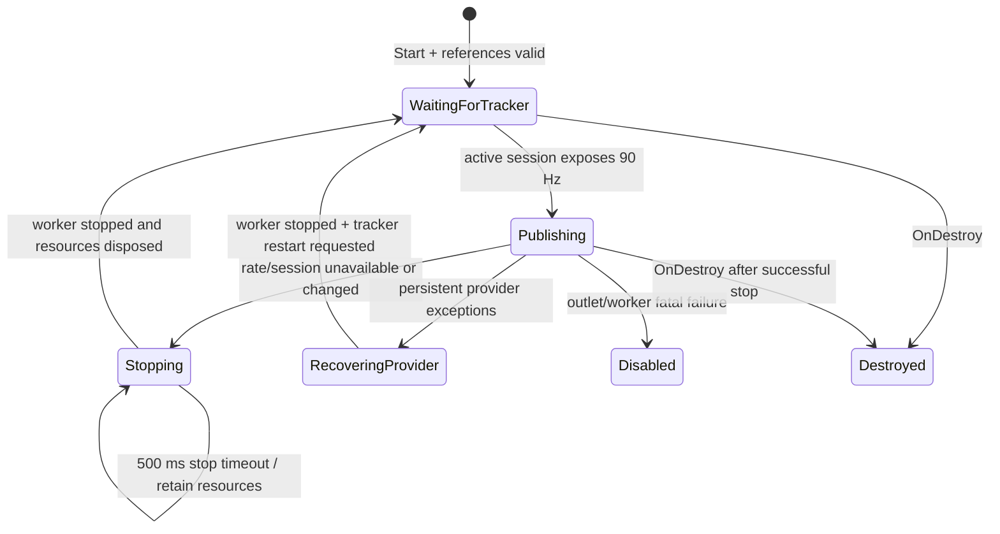

Invariants:

- Stream info and outlet are not replaced while the old worker might still call them.
- A 500 ms worker-stop timeout returns false and retains worker/outlet ownership for a later update.
- Provider exceptions are tolerated transiently. Consecutive failures reaching approximately one nominal second request tracker recovery.
- Invalid capture timestamps are dropped, but publisher cadence still advances.
- Outlet exceptions become fatal worker failures.
- Outlet recreation uses the configured stream name/type/source ID and current nominal rate.

The model-target outlet has a simpler lifecycle: validate references, create once, push every `LateUpdate`, disable on creation/push exception, and release references on destruction.

### Device lifecycle validation

- [ ] Permission denied leaves the component unavailable without a partial outlet.
- [ ] A tracker without exact 90 Hz support never starts publishing.
- [ ] Late `OpenAsync` completion from an old lifecycle cannot replace the current tracker.
- [ ] Removal clears both queues and prevents old-generation samples from publishing.
- [ ] Transient provider exceptions do not immediately replace the tracker.
- [ ] Persistent provider exceptions stop the worker before restarting the tracker.
- [ ] A worker-stop timeout retains outlet resources until the worker exits.
- [ ] Recreated outlet retains configured identity and does not publish backwards timestamps.
- [ ] Component destruction stops watcher/tracker and publishing without use-after-dispose.

Use the hardware procedure in [device-parity-runbook.md](device-parity-runbook.md) for evidence.

## Evidence sources

- `vicon-lsl-bridge/src/ViconLSLBridge.cpp`
- `vicon-lsl-bridge/src/ViconClient.cpp`
- `vicon-lsl-bridge/src/ViconFrameMapper.*`
- `vicon-lsl-bridge/src/gui/BridgeWindow.*`
- `vicon-lsl-bridge/src/gui/LabRecorderClient.*`
- `vicon-lsl-bridge/src/gui/LabRecorderRuntimePolicy.*`
- `vicon-lsl-bridge/src/gui/PreviewPanel.*`
- `vicon-lsl-bridge/src/gui/PreviewStreamWorker.*`
- `hololens-gaze-lsl/Assets/Scripts/GazeDataProvider.cs`
- `hololens-gaze-lsl/Assets/Scripts/GazePublisherWorker.cs`
- `hololens-gaze-lsl/Assets/Scripts/GazeLSLOutlet.cs`
- `hololens-gaze-lsl/Assets/Scripts/VuforiaModelTargetPoseOutlet.cs`
- Existing state and recovery tests under `vicon-lsl-bridge/tests` and `hololens-gaze-lsl/Tests`
