# How services start, stop, and recover

## Why this guide exists

This guide lists the current startup, failure, retry, and shutdown order. A code-only cleanup may move this work into smaller files, but it must not change the order, wait times, owners, or reported states.

Related guides:

- [How the code is organized](architecture.md)
- [Behavior that must stay the same](behavior-contract.md)
- [How time and coordinates work](time-and-coordinate-semantics.md)

## Desktop bridge

### States visible to other code

`BridgeState` has four values:

- `Disconnected`
- `Connecting`
- `Streaming`
- `Stopped`

The bridge also performs internal steps for connection retry, first-frame reading, layout discovery, stream creation, layout replacement, and cleanup.

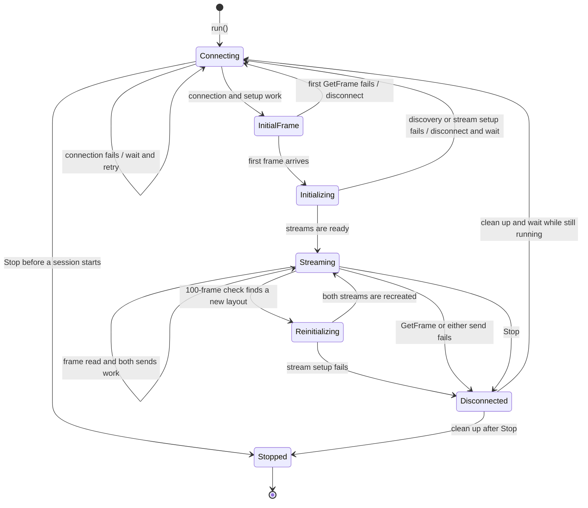
```mermaid
stateDiagram-v2
    [*] --> Connecting: run()
    Connecting --> Connecting: connection fails / wait and retry
    Connecting --> Stopped: Stop before a session starts
    Connecting --> InitialFrame: connection and setup work
    InitialFrame --> Connecting: first GetFrame fails / disconnect
    InitialFrame --> Initializing: first frame arrives
    Initializing --> Connecting: discovery or stream setup fails / disconnect and wait
    Initializing --> Streaming: streams are ready
    Streaming --> Streaming: frame read and both sends work
    Streaming --> Reinitializing: 100-frame check finds a new layout
    Reinitializing --> Streaming: both streams are recreated
    Reinitializing --> Disconnected: stream setup fails
    Streaming --> Disconnected: GetFrame or either send fails
    Streaming --> Disconnected: Stop
    Disconnected --> Connecting: clean up and wait while still running
    Disconnected --> Stopped: clean up after Stop
    Stopped --> [*]
```

### Connect

1. `run()` creates one `ViconTimestampState` before the reconnect loop.
2. `connectWithRetry()` reports `Connecting` before the first attempt.
3. After a failed attempt, report the wait time and sleep in pieces no longer than 100 ms.
4. A complete connection sets `ServerPush` mode and enables segment and marker data.
5. If any setup call fails, disconnect the SDK client and treat the connection as failed.
6. If Stop arrives during retry, leave the loop and report `Stopped`.

### Read the first frame and create streams

1. Read one Vicon frame before discovering names or creating streams.
2. If this first `GetFrame` fails, report `Connecting`, disconnect, and start the outer connection loop again. This path does not call the normal retry wait first.
3. On success, update `frame_count_`.
4. Stop discovery at the first failed count or name read. Return no layout and include the errors.
5. Clear errors from an earlier session only after discovery succeeds.
6. Use the Vicon frame rate as the LSL expected rate only when it is positive and finite. Otherwise, use irregular rate.
7. If the computer name cannot be read, use `default` in source IDs.
8. Create the marker stream before the segment stream. If either throws, close both and report failure.
9. An empty layout succeeds without creating an LSL stream.

### Send frames

For each pass through the streaming loop:

1. Read a frame. Leave the session if `GetFrame` fails.
2. Choose a finite timestamp that is later than the previous one. If no finite time can be made, skip that frame without sending it.
3. `buildViconFrame` reads every known marker and segment and returns fixed-size values plus any errors.
4. Send markers first and segments second with the same timestamp.
5. A hidden or failed item becomes an invalid fixed-size value. It does not stop the session.
6. If either LSL send fails, report that streams will be recreated and leave the session.
7. Group read errors after both send attempts.
8. After 100 handled loop passes, reset the layout counter, report status, and discover the layout again.

### Handle a layout check

- If discovery fails, report the error and keep the existing streams.
- If the layout is unchanged, continue streaming.
- If it changed, close both streams before creating replacements.
- If replacement fails, leave streaming and perform full cleanup.
- If replacement works, report that the streams were recreated.

### Clean up

Use this order:

1. Close the marker stream.
2. Close the segment stream.
3. Disconnect the Vicon client.
4. Reset frame count, layout counter, known layout, grouped errors, and the last error message.
5. Report `Disconnected`.
6. If still running, wait and reconnect.
7. Otherwise, report `Stopped` and return.

Do not reset the timestamp state during reconnect. Stable source IDs and always-increasing timestamps let LabRecorder treat a recreated stream as the same recovered stream.

The run flag starts as true when the object is created. `run()` does not set it back to true. The desktop app creates a new bridge after each Stop.

### Bridge checks

- [ ] Stop before the first connection reports `Stopped` and returns quickly.
- [ ] Repeated connection failures wait for the chosen interval.
- [ ] A setup failure disconnects before retry.
- [ ] A first-frame failure reconnects without publishing part of a layout.
- [ ] A discovery failure discards partial names and waits before retry.
- [ ] Empty marker, segment, or both layouts reach `Streaming` without unwanted streams.
- [ ] Hidden or failed reads send invalid fixed-size values and keep streaming.
- [ ] A stream-creation exception closes any companion stream already created.
- [ ] A marker or segment send failure closes both streams and reconnects.
- [ ] Layout checks keep the 100-frame timing.
- [ ] A layout read error keeps current streams; a real change replaces both.
- [ ] Marker and segment samples from one frame have the same timestamp.
- [ ] Timestamps keep increasing after reconnect when source IDs stay the same.
- [ ] Stopping a live session reports `Disconnected` before `Stopped`.

## Desktop window and bridge worker

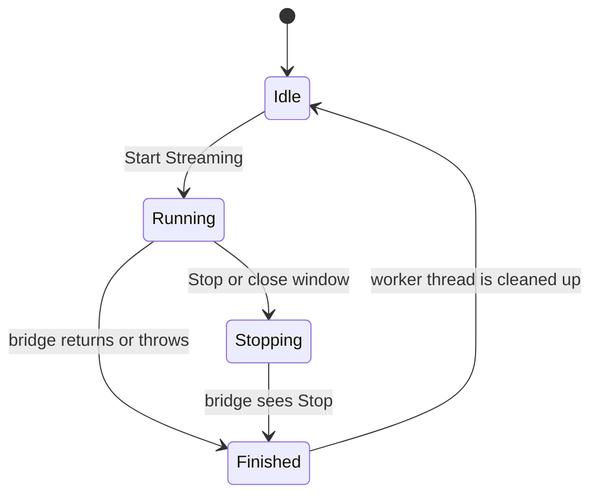
```mermaid
stateDiagram-v2
    [*] --> Idle
    Idle --> Running: Start Streaming
    Running --> Stopping: Stop or close window
    Running --> Finished: bridge returns or throws
    Stopping --> Finished: bridge sees Stop
    Finished --> Idle: worker thread is cleaned up
```

- `BridgeWindow::onStart()` copies the server and two stream names into `Config`, saves them, disables the fields, creates one `BridgeWorker`, connects its signals, and starts it.
- The worker adds the bridge status callback inside `run()`.
- If the bridge throws, the worker sends `terminal(Failed, message)`.
- `onStop()` disables the Stop button and requests Stop. It does not destroy the worker itself.
- `onWorkerFinished()` restores the controls, clears rate and stale-state data, schedules thread deletion, clears the pointer, and lets a pending window close continue.

### Status age

- The GUI rate is the change in frame number divided by the time between GUI status messages.
- Normal status messages follow the 100-frame layout check, with extra messages for state changes and errors.
- If no streaming status arrives for more than 3000 ms, mark it stale once and show `0.0 Hz`.
- A new status clears the stale mark.

## LabRecorder remote connection

### Connection state

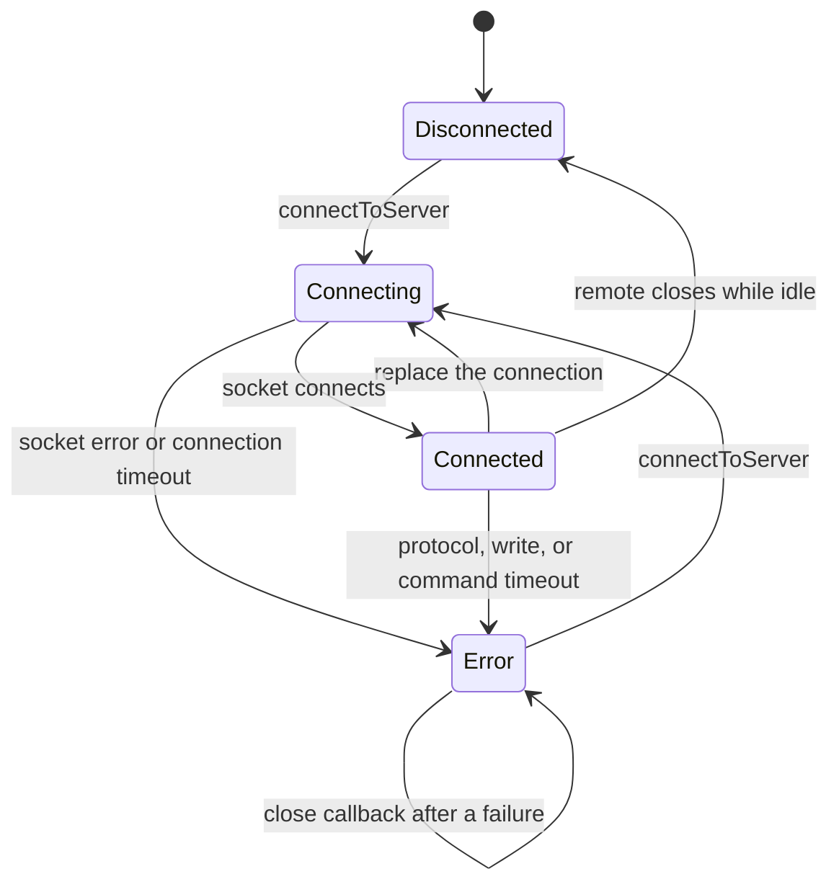
```mermaid
stateDiagram-v2
    [*] --> Disconnected
    Disconnected --> Connecting: connectToServer
    Error --> Connecting: connectToServer
    Connected --> Connecting: replace the connection
    Connecting --> Connected: socket connects
    Connecting --> Error: socket error or connection timeout
    Connected --> Error: protocol, write, or command timeout
    Connected --> Disconnected: remote closes while idle
    Error --> Error: close callback after a failure
```

`connectToServer()` replaces the old connection:

1. Stop both timers.
2. Clear queued command groups.
3. Fail active work as replaced without starting another group.
4. Clear unsent command data and partial replies.
5. Close the old socket now.
6. Store separate connection and command timeouts.
7. Set recording state to `Unknown`.
8. Set connection state to `Connecting`, begin connecting, and start the connection timer if still needed.

After the socket connects, connection state is `Connected`. Recording state stays `Unknown` until this client receives a good reply to Start or Stop.

### Recording state

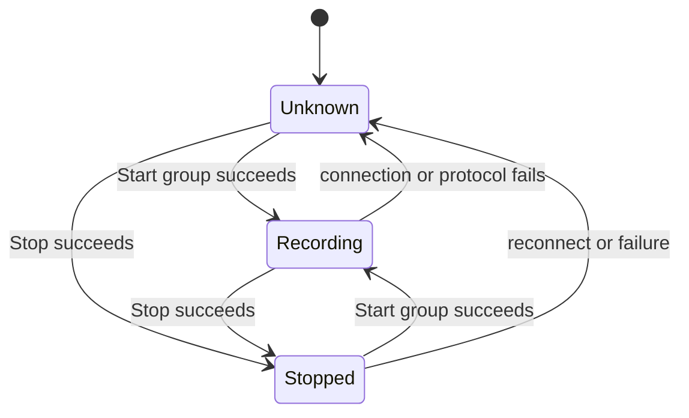
```mermaid
stateDiagram-v2
    [*] --> Unknown
    Unknown --> Recording: Start group succeeds
    Stopped --> Recording: Start group succeeds
    Unknown --> Stopped: Stop succeeds
    Recording --> Stopped: Stop succeeds
    Recording --> Unknown: connection or protocol fails
    Stopped --> Unknown: reconnect or failure
```

The acknowledged state is only one part of the control policy. `LabRecorderClient` also tracks desired state and one operation state:

- `Idle`
- `Refreshing`
- `UpdatingFilename`
- `Starting`
- `Stopping`
- `ShuttingDown`

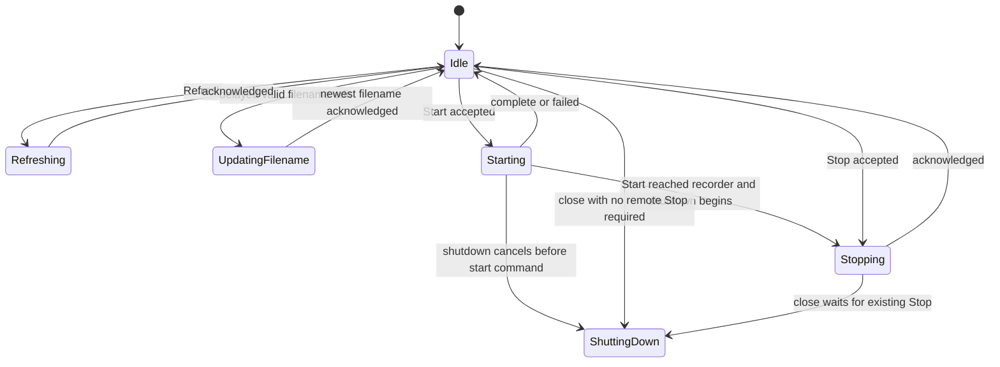
```mermaid
stateDiagram-v2
    [*] --> Idle
    Idle --> Refreshing: Refresh
    Idle --> UpdatingFilename: delayed valid filename edit
    Idle --> Starting: Start accepted
    Refreshing --> Idle: acknowledged
    UpdatingFilename --> Idle: newest filename acknowledged
    Starting --> Idle: complete or failed
    Starting --> Stopping: Start reached recorder and shutdown begins
    Starting --> ShuttingDown: shutdown cancels before start command
    Idle --> Stopping: Stop accepted
    Stopping --> Idle: acknowledged
    Idle --> ShuttingDown: close with no remote Stop required
    Stopping --> ShuttingDown: close waits for existing Stop
```

Controls use connection, acknowledged state, desired state, operation, queue depth, exact-path validity, and shutdown state together. A second Start or Stop is rejected. Refresh and filename work cannot enter an atomic Start group. Stop removes queued nonessential work. Unsent filename updates coalesce to the newest value. The queue is limited to eight batches.

While acknowledged state is `Unknown`, recovery Start or Stop is possible only when the connection is active and no incompatible operation is in flight. The GUI always shows `Starting`, `Recording`, `Stopping`, `Stopped`, or `Unknown` explicitly and shows the active command number awaiting acknowledgement.

### Command groups

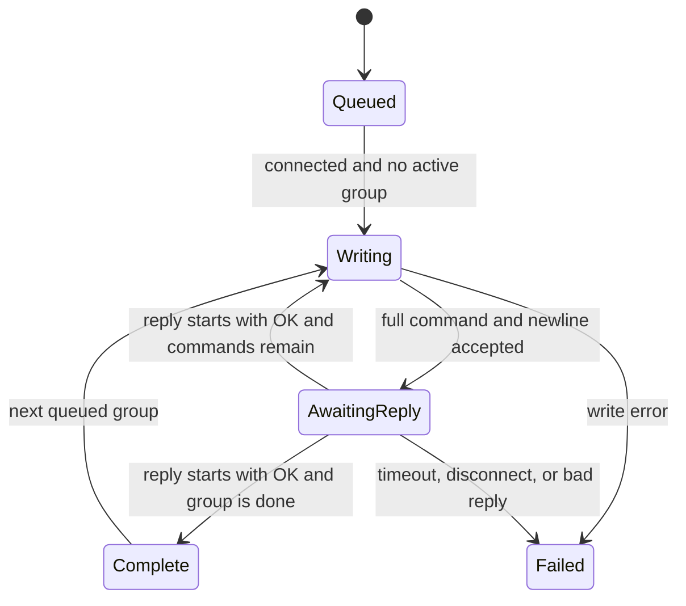
```mermaid
stateDiagram-v2
    [*] --> Queued
    Queued --> Writing: connected and no active group
    Writing --> AwaitingReply: full command and newline accepted
    AwaitingReply --> Writing: reply starts with OK and commands remain
    AwaitingReply --> Complete: reply starts with OK and group is done
    Writing --> Failed: write error
    AwaitingReply --> Failed: timeout, disconnect, or bad reply
    Complete --> Writing: next queued group
```

Keep these rules:

- Only one group is active.
- Only one command in that group waits for a reply.
- Keep any part of a command that the socket has not accepted yet.
- Keep reply pieces until `OK` can be checked.
- Ignore leading carriage returns, line feeds, spaces, and tabs.
- The two bytes `OK` are enough. Do not wait for the rest of the line.
- A failure clears later queued work and closes the connection.
- A good group changes recording state only when the group declares a state other than `Unknown`.
- Start is one indivisible `update`, `select all`, `filename`, `start` group for record-every-visible mode.
- A shutdown before `start` is written cancels the Start after the currently active preparation command. A shutdown after `start` may have been written makes `stop` the final command.
- A timeout, malformed reply, disconnect, or permitted replacement connection deterministically fails active work, clears queued work, and returns acknowledged and desired state to `Unknown`. Replacement is rejected while connected recording work is active; reconnect after loss retains uncertain sent-Start evidence until Stop is acknowledged.

### Start the included LabRecorder

1. Probe the configured remote-control endpoint first. Never launch a duplicate process when that endpoint is already reachable.
2. Launch only when automatic launch is enabled and the endpoint probe has definitely failed.
3. Use a valid user-selected program first. Otherwise, look for `labrecorder/LabRecorder.exe` beside the desktop app.
4. Launch asynchronously with the executable directory as working directory. State is `External`, `Launching`, `OwnedRunning`, `OwnedExited`, `LaunchFailed`, or `Detached`.
5. Drain standard output and error into the event log while retaining at most 64 KiB of process output and 4 KiB per emitted line.
6. Retry remote control every 250 ms only while neither connected nor connecting, for at most 15 seconds.
7. Disconnecting from an external process never ends it. Detach relinquishes ownership of a launched process without ending it.

Exact-selection mode starts the packaged `LabRecorderCLI` asynchronously with one absolute output path and one identity predicate per selected stream. Source ID is preferred; name fallback is constrained by host. Pressing Stop writes the CLI's Enter terminator. This process is owned and is never confused with an external graphical recorder.

### LabRecorder checks

- [ ] Replacing a connection fails active work and clears queued work.
- [ ] The connection timeout does not change the command timeout.
- [ ] Partial writes and split `OK` replies move forward by exactly one command.
- [ ] A bad reply closes the connection and reports no more than its first 80 bytes.
- [ ] Start sends `update`, `select all`, `filename`, and `start` in that order.
- [ ] A timeout or disconnect stops all later commands in the group.
- [ ] Recording state changes only after a confirmed Start or Stop.
- [ ] Double Start and Stop produce exactly one remote operation.
- [ ] Close during every Start command either cancels before `start` or sends one final `stop`.
- [ ] Connection replacement, malformed reply, disconnect, and process exit leave actionable typed states.
- [ ] Endpoint probing precedes launch; custom and bundled lookup, working directory, bounded output, detach, and the 15-second deadline remain correct.

## Closing the desktop window

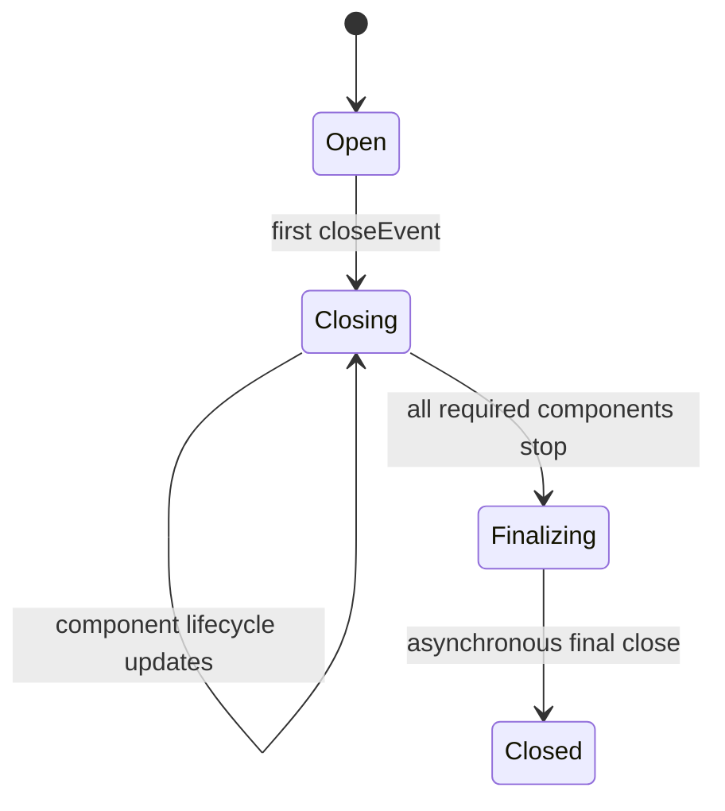
```mermaid
stateDiagram-v2
    [*] --> Open
    Open --> Closing: first closeEvent
    Closing --> Closing: repeated close / report current deadlines
    Closing --> Closing: component lifecycle updates
    Closing --> Finalizing: all required components stop
    Finalizing --> Closed: asynchronous final close
```

On the first close request:

- Enter one noninteractive `Closing` workflow and ignore duplicate shutdown creation.
- Freeze new Start, discovery, filename, and guided work.
- Snapshot which bridge, preview, file/discovery, verification, and recorder components are required, with monotonic stop-request timestamps and deadlines.
- Call `LabRecorderClient::beginShutdown()`. It cancels a Start that has not reached `start`; otherwise it arranges or waits for one final Stop. An already active Stop is never duplicated.
- Stop preview and bridge asynchronously, cancel file discovery/loading and verification, and keep the window/event loop alive.
- Poll state every 50 ms only to update the visible component and remaining-time display. No poll declares a still-running worker destroyed.

The observable deadlines are four seconds for the bridge, two seconds for preview/file workers, and 15 seconds for recorder settlement. These are diagnostic outcomes rather than GUI-thread waits. A non-cancellable Vicon SDK call may keep its worker alive after four seconds; the GUI remains responsive and continues showing that component until it actually returns. LSL live-preview resolve and metadata calls are bounded at 50 ms and 250 ms respectively, and sample polling is nonblocking.

An owned recorder may be ended only after remote Stop is settled or the 15-second recorder deadline is exceeded. Termination receives one further second before a force-end. An external process is never ended. If the remote connection is already lost, external ownership settles locally with a recorded `RecorderConnectionLost` result; an owned process waits for the recorder deadline.

Normal destructors do not wait for active work: direct teardown detaches still-running workers so they delete themselves on `finished`. Defensive worker destructors have finite two-second waits and a final 100 ms cleanup fallback, but the normal window-close path never reaches those destructors while they are active.

The maximum ordinary GUI-thread operation budget is 50 ms. Stop requests only set cancellation/interruption state and return; actual SDK, LSL, file, process, and verification cleanup stays off the GUI thread.

Check normal replies, every pending-Start command, active Stop, disconnect, owned/external process rules, bridge connection/stream/reconnect/SDK delay, preview resolution/metadata/poll/calibration, file opening, verification cancellation, and repeated close requests.

## Preview

### Change between live and recorded data

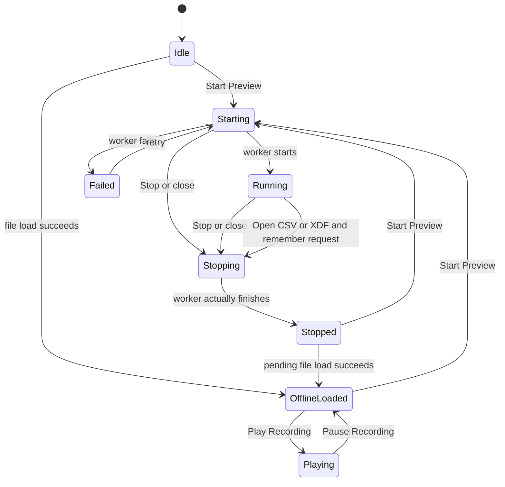
```mermaid
stateDiagram-v2
    [*] --> Idle
    Idle --> Starting: Start Preview
    Starting --> Running: worker starts
    Starting --> Stopping: Stop or close
    Running --> Stopping: Stop or close
    Running --> Stopping: Open CSV or XDF and remember request
    Stopping --> Stopped: worker actually finishes
    Stopped --> Starting: Start Preview
    Idle --> OfflineLoaded: file load succeeds
    Stopped --> OfflineLoaded: pending file load succeeds
    OfflineLoaded --> Playing: Play Recording
    Playing --> OfflineLoaded: Pause Recording
    OfflineLoaded --> Starting: Start Preview
    Starting --> Failed: worker fails
    Failed --> Starting: retry
```

- Starting live preview stops playback, clears old trails, copies the identity
  bindings and controls into `PreviewWorkerConfig`, starts the one-frame latest
  mailbox, and starts a worker. Calibration collection begins only when the user
  selects **Calibrate from Stair Target**.
- Stop only sets interruption state and returns within the ordinary 50 ms GUI
  budget. The panel stays in `Stopping`, with restart and file-open controls
  disabled, until the worker truly ends. The two-second preview deadline is a
  visible shutdown diagnostic, not a destructive wait.
- Opening a CSV or XDF while live stores one pending file, asks the worker to stop, and loads the file only after `finished` arrives.
- CSV and XDF use the same playback storage and clock after loading.
- Live rendering runs at the configured 30 or 60 Hz and consumes only the newest
  mailbox frame. Source-rate tracking, inlet-backlog coalescing, calibration
  samples, display replacements, and display latency remain separate counters.

### One live stream

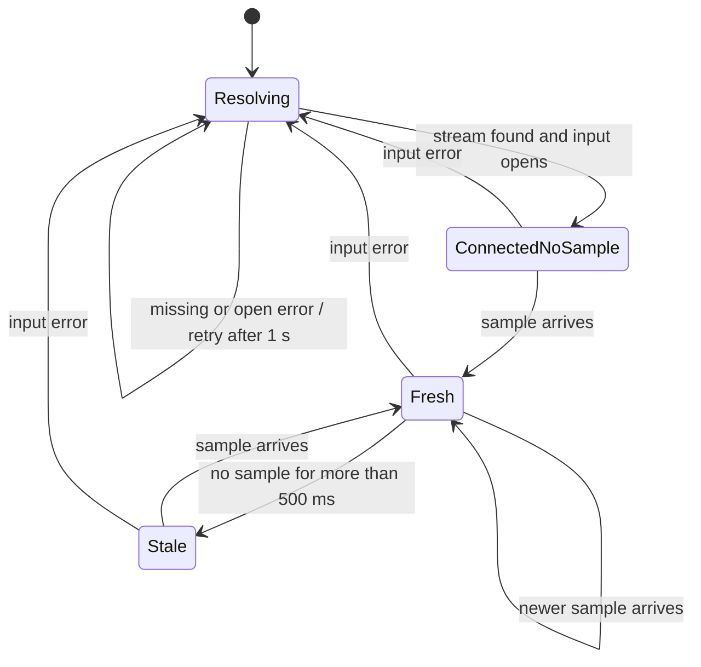
```mermaid
stateDiagram-v2
    [*] --> Resolving
    Resolving --> ConnectedNoSample: stream found and input opens
    Resolving --> Resolving: missing or open error / retry after 1 s
    ConnectedNoSample --> Fresh: sample arrives
    Fresh --> Fresh: newer sample arrives
    Fresh --> Stale: no sample for more than 500 ms
    Stale --> Fresh: sample arrives
    ConnectedNoSample --> Resolving: input error
    Fresh --> Resolving: input error
    Stale --> Resolving: input error
```

Connection and freshness are different. `PreviewFrame::*_stream_present` means an input is connected even when it has no sample or its last sample is old.

Resolution normally requires the saved source ID. If the same source returns in
several publisher instances, choose the newest creation time and report the
recovery. A missing identity never silently degrades to a name-only match.
**Follow by name** permits a deterministic name match and reports ambiguity or
fallback. Resolve calls use a 50 ms timeout, metadata calls use 250 ms, pulls are
nonblocking, and a missing stream retries after one second.

### Recorded file loading and mapping

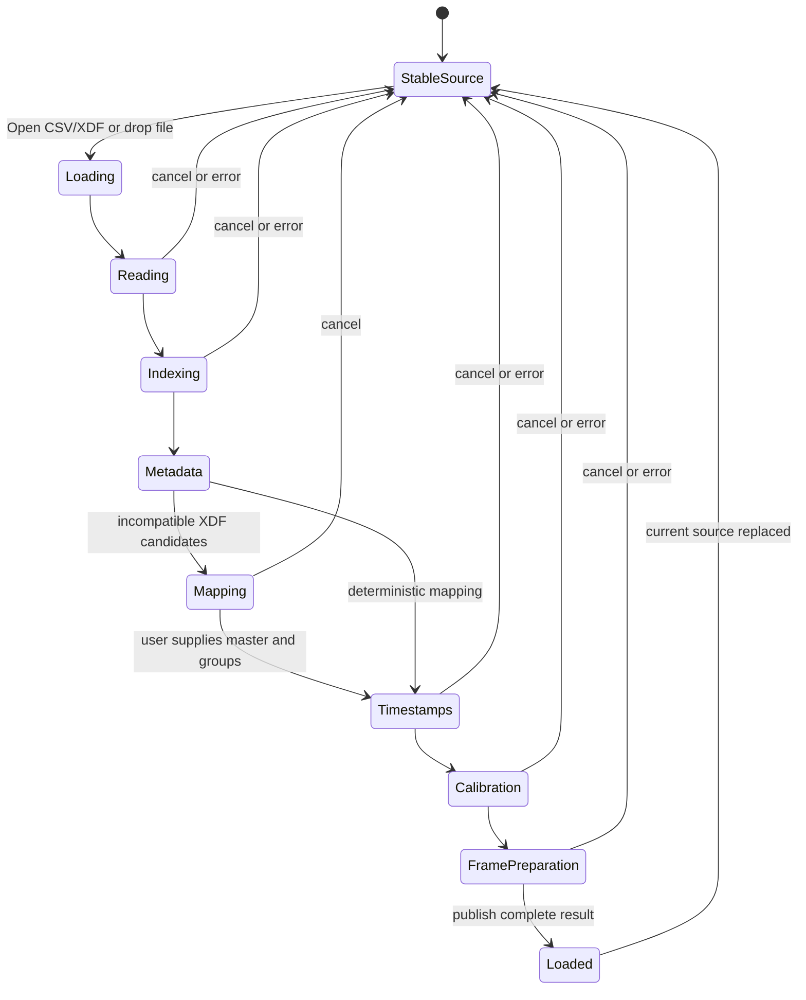
```mermaid
stateDiagram-v2
    [*] --> StableSource
    StableSource --> Loading: Open CSV/XDF or drop file
    Loading --> Reading
    Reading --> Indexing
    Indexing --> Metadata
    Metadata --> Mapping: incompatible XDF candidates
    Mapping --> Timestamps: user supplies master and groups
    Metadata --> Timestamps: deterministic mapping
    Timestamps --> Calibration
    Calibration --> FramePreparation
    FramePreparation --> Loaded: publish complete result
    Reading --> StableSource: cancel or error
    Indexing --> StableSource: cancel or error
    Mapping --> StableSource: cancel
    Timestamps --> StableSource: cancel or error
    Calibration --> StableSource: cancel or error
    FramePreparation --> StableSource: cancel or error
    Loaded --> StableSource: current source replaced
```

The worker owns reading, indexing, metadata inventory, timestamp correction,
mapping, calibration evaluation, and bounded frame assembly. It checks
cancellation between at most 1,024 lines, chunks, samples, or sample groups, and
signals progress for every stage. The 250 ms cancellation budget includes a
mapping wait, which is woken explicitly. Failure or cancellation retains the
previous usable source and never publishes a partial recording.

Before XDF assembly, group supported candidates by role, source ID, name, host,
and schema. Compatible recovered instances are stitched. Source-ID collisions
across hosts and other incompatible same-role groups require explicit mapping.
The mapping chooses the master and selected groups; the result summary records
master ID, selected IDs, excluded groups, stitched instances, time ranges,
unmatched samples, and clock corrections. No supported role means failure rather
than an arbitrary numeric master.

Playback is `Loaded`, `Playing`, or `Paused`. A seek updates the shared CSV/XDF
clock without changing speed. Start/end, one-frame and configurable-time steps,
loop-off end behavior, loop-on wrapping, recent-file opening, drag-and-drop, and
current-image export are explicit transitions. The configured cache bounds the
decoded result, and decimation affects drawing only, not verifier statistics.

### Stair alignment

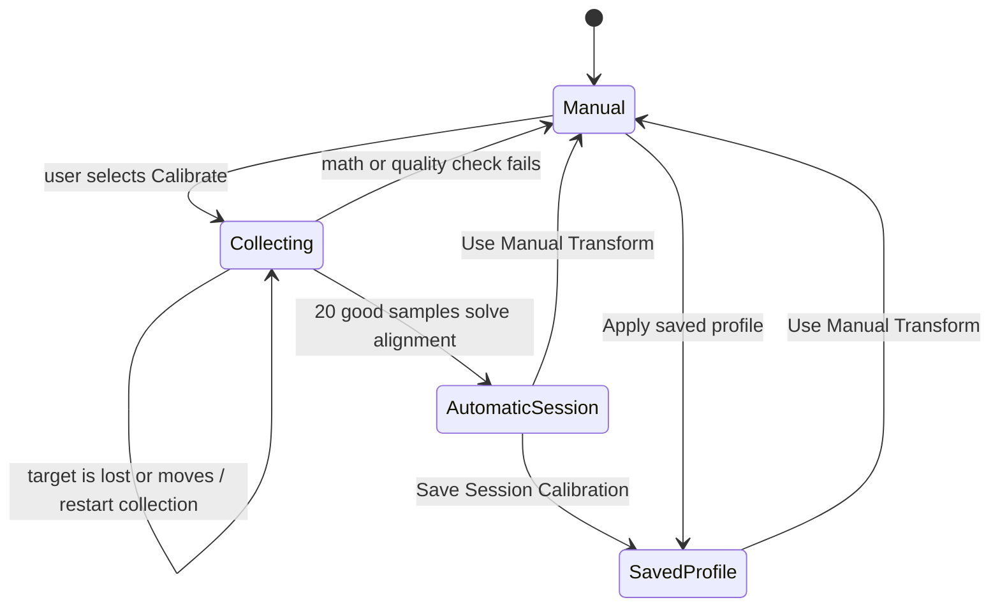
```mermaid
stateDiagram-v2
    [*] --> Manual
    Manual --> Collecting: user selects Calibrate
    Collecting --> Collecting: add a stable tracked pose
    Collecting --> Collecting: target is lost or moves / restart collection
    Collecting --> Manual: math or quality check fails
    Collecting --> AutomaticSession: 20 good samples solve alignment
    AutomaticSession --> SavedProfile: Save Session Calibration
    AutomaticSession --> Manual: Use Manual Transform
    SavedProfile --> Manual: Use Manual Transform
    Manual --> SavedProfile: Apply saved profile
```

- Losing the target clears the collected poses.
- A pose outside the allowed movement from the first pose restarts collection from that new pose.
- Missing or incompatible coordinate metadata pauses collection for an explicit
  fallback confirmation. Compatibility and the rejection reason remain visible.
- Automatic alignment stays in memory for the desktop session and is not saved
  unless the user explicitly creates a complete managed profile.
- Transform changes reach the worker through a lock. The drawing area then asks to fit the view again.
- Profile import/export, duplicate, retirement, stair-pose editing, and Apply
  preserve profile ID, version, physical setup, stair identity, coordinate
  frames, notes, creation time, sample count, and translation/rotation RMS.
- Calibration progress is emitted no faster than every 100 ms so the target
  stream cannot dominate GUI work.

## Guided preflight and recording workflow

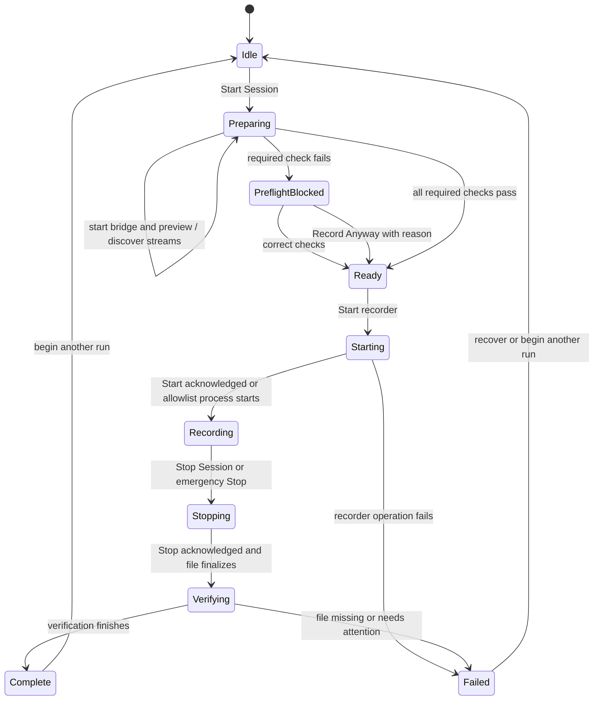
```mermaid
stateDiagram-v2
    [*] --> Idle
    Idle --> Preparing: Start Session
    Preparing --> Preparing: start bridge and preview / discover streams
    Preparing --> PreflightBlocked: required check fails
    PreflightBlocked --> Ready: correct checks
    PreflightBlocked --> Ready: Record Anyway with reason
    Preparing --> Ready: all required checks pass
    Ready --> Starting: Start recorder
    Starting --> Recording: Start acknowledged or allowlist process starts
    Starting --> Failed: recorder operation fails
    Recording --> Stopping: Stop Session or emergency Stop
    Stopping --> Verifying: Stop acknowledged and file finalizes
    Verifying --> Complete: verification finishes
    Verifying --> Failed: file missing or needs attention
    Failed --> Idle: recover or begin another run
    Complete --> Idle: begin another run
```

Preflight items are `Required`, `Warning`, or `Information`. Required bridge,
recorder, path, selected identity, freshness, and schema failures block Start.
Recorder-only mode turns the bridge requirement into information. Warnings such
as low storage, incomplete metadata, duplicate candidates, or low nominal rate
stay visible but do not block. A blocked result can be overridden only with a
nonempty reason; both the result and reason enter the event log and diagnostic
bundle.

The guided workflow starts bridge, preview, discovery, preflight, and recorder
in order while preserving independent controls. Its reverse workflow stops the
recorder, waits for verification, then stops preview and bridge. Any partially
completed state remains visible and independently stoppable.

## Post-recording verification

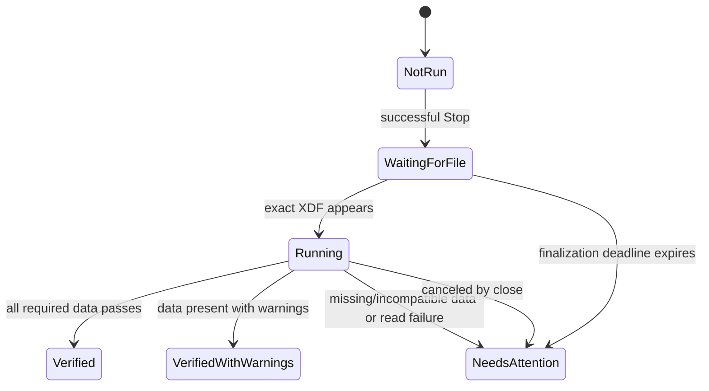
```mermaid
stateDiagram-v2
    [*] --> NotRun
    NotRun --> WaitingForFile: successful Stop
    WaitingForFile --> Running: exact XDF appears
    WaitingForFile --> NeedsAttention: finalization deadline expires
    Running --> Verified: all required data passes
    Running --> VerifiedWithWarnings: data present with warnings
    Running --> NeedsAttention: missing/incompatible data or read failure
    Running --> NeedsAttention: canceled by close
```

The verifier runs outside the GUI thread and never changes the recording. It
compares the recorded inventory with preflight selection and expected bindings,
then reports identity, schema, sample count, range, duration, effective rate,
gaps, clock corrections, repaired timestamps, and truncated-tail recovery. Its
report is exportable and links to playback. Automatic run increment occurs only
after the output exists and the selected completion policy passes.

## HoloLens tracker and provider

### Tracker life

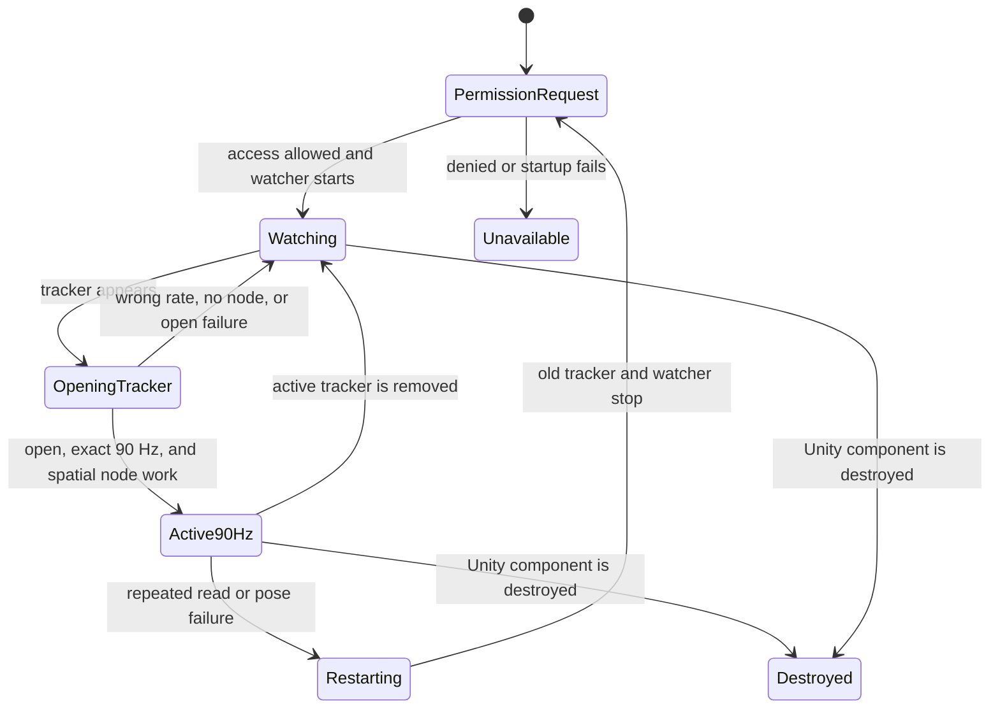
```mermaid
stateDiagram-v2
    [*] --> PermissionRequest
    PermissionRequest --> Watching: access allowed and watcher starts
    PermissionRequest --> Unavailable: denied or startup fails
    Watching --> OpeningTracker: tracker appears
    OpeningTracker --> Active90Hz: open, exact 90 Hz, and spatial node work
    OpeningTracker --> Watching: wrong rate, no node, or open failure
    Active90Hz --> Watching: active tracker is removed
    Active90Hz --> Restarting: repeated read or pose failure
    Restarting --> PermissionRequest: old tracker and watcher stop
    Active90Hz --> Destroyed: Unity component is destroyed
    Watching --> Destroyed: Unity component is destroyed
```

Four counters and guards keep old work out of a new session:

- `watcherGeneration` rejects a late result from an old watcher start.
- `trackerLifecycleGeneration` rejects a late `OpenAsync` result after removal or restart.
- `sessionGeneration` marks raw readings and tells the LSL output when the tracker session changes.
- Starting, removing, or restarting a tracker resets the reading-time guard, clears both queues, and clears pose-failure counts.

### One gaze sample

At each publishing step:

1. `TryGetNextSample` reads at most one raw value while holding the tracker guard.
2. Reject a missing, old, duplicate, out-of-order, or invalid capture time.
3. Copy the combined ray and any available left and right rays in tracker space.
4. Add the raw reading under the 25 ms time-span and 360-item limits.
5. Unity `Update` handles at most 32 raw readings. For each one, find the device pose at the original time, convert the rays, and add a `GazeSample` to the next queue.
6. Before publishing, reduce an over-limit converted queue to its newest value and then take the oldest retained value.

If finding the device pose simply fails, still make a sample at the capture time with invalid rays. If it throws repeatedly, restart the tracker. Never invent a new capture time.

## HoloLens LSL output

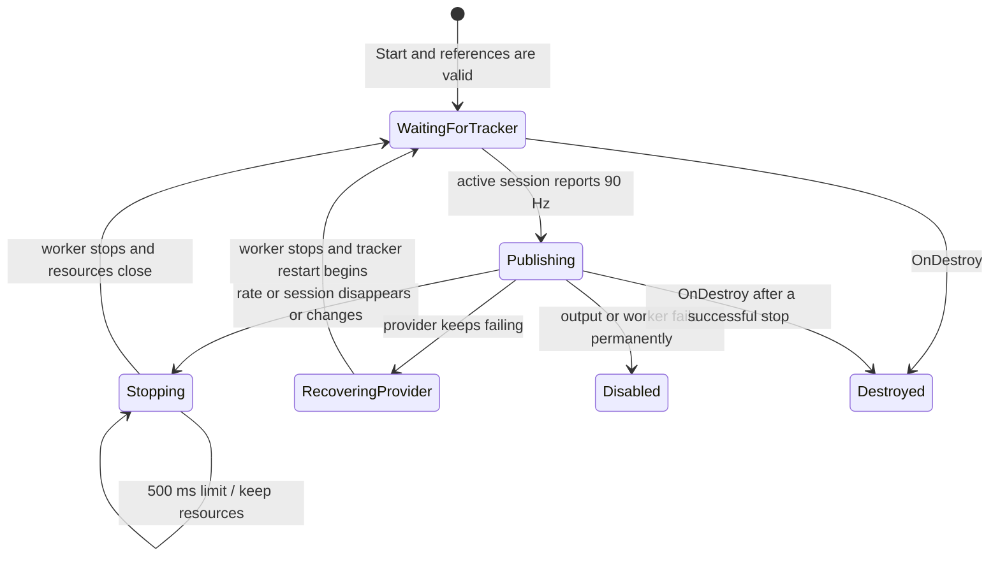
```mermaid
stateDiagram-v2
    [*] --> WaitingForTracker: Start and references are valid
    WaitingForTracker --> Publishing: active session reports 90 Hz
    Publishing --> Stopping: rate or session disappears or changes
    Publishing --> RecoveringProvider: provider keeps failing
    Publishing --> Disabled: output or worker fails permanently
    RecoveringProvider --> WaitingForTracker: worker stops and tracker restart begins
    Stopping --> WaitingForTracker: worker stops and resources close
    Stopping --> Stopping: 500 ms limit / keep resources
    WaitingForTracker --> Destroyed: OnDestroy
    Publishing --> Destroyed: OnDestroy after a successful stop
```

Keep these rules:

- Do not replace or close the stream while the old worker may still send to it.
- If the worker does not stop within 500 ms, keep the worker and stream and try again during a later update.
- Brief provider errors do not replace the tracker. About one second of back-to-back provider errors starts recovery.
- Drop bad capture timestamps, but continue the publishing schedule.
- Treat an LSL output exception as a permanent worker failure.
- When recreating the stream, use the saved name, type, source ID, and current expected rate.

The model-target output has fewer states. It checks its references, creates one stream, and sends in every `LateUpdate`. A creation or send exception disables it. Destruction releases its references.

### Device checks

- [ ] Denied permission leaves no partial stream.
- [ ] A tracker without exact 90 Hz never starts publishing.
- [ ] A late `OpenAsync` result from an old session cannot replace the current tracker.
- [ ] Removal clears both queues and blocks old-session samples.
- [ ] Brief provider errors do not restart the tracker at once.
- [ ] Lasting provider errors stop the worker before tracker restart.
- [ ] A worker stop timeout keeps output resources until the worker ends.
- [ ] A recreated stream keeps its identity and never sends an earlier timestamp.
- [ ] Destroying the component stops the watcher, tracker, and worker before releasing resources.

Use the [hardware test guide](device-parity-runbook.md) to collect device evidence.

## Main source files

- `vicon-lsl-bridge/src/ViconLSLBridge.cpp`
- `vicon-lsl-bridge/src/ViconClient.cpp`
- `vicon-lsl-bridge/src/ViconFrameMapper.*`
- `vicon-lsl-bridge/src/gui/BridgeWindow.*`
- `vicon-lsl-bridge/src/gui/LabRecorderClient.*`
- `vicon-lsl-bridge/src/gui/LabRecorderRuntimePolicy.*`
- `vicon-lsl-bridge/src/gui/PreviewPanel.*`
- `vicon-lsl-bridge/src/gui/PreviewStreamWorker.*`
- `hololens-gaze-lsl/Assets/Scripts/GazeDataProvider.cs`
- `hololens-gaze-lsl/Assets/Scripts/GazePublisherWorker.cs`
- `hololens-gaze-lsl/Assets/Scripts/GazeLSLOutlet.cs`
- `hololens-gaze-lsl/Assets/Scripts/VuforiaModelTargetPoseOutlet.cs`
- State and recovery checks under `vicon-lsl-bridge/tests` and `hololens-gaze-lsl/Tests`
