# How each part starts, stops, and recovers

## What this guide is for

This guide lists the order things happen when each part starts, fails, retries, and shuts down. A code tidy-up may move this work into smaller files, but it must not change the order, wait times, who owns what, or the states that get reported.

Related guides:

- [How the code is organized](architecture.md)
- [Behavior that must stay the same](behavior-contract.md)
- [How time and coordinates work](time-and-coordinate-semantics.md)

## Desktop bridge

### States other code can see

`BridgeState` has four values:

- `Disconnected`
- `Connecting`
- `Streaming`
- `Stopped`

Inside, the bridge also goes through steps for retrying, reading the first frame, reading the layout, opening streams, replacing streams, and cleaning up.

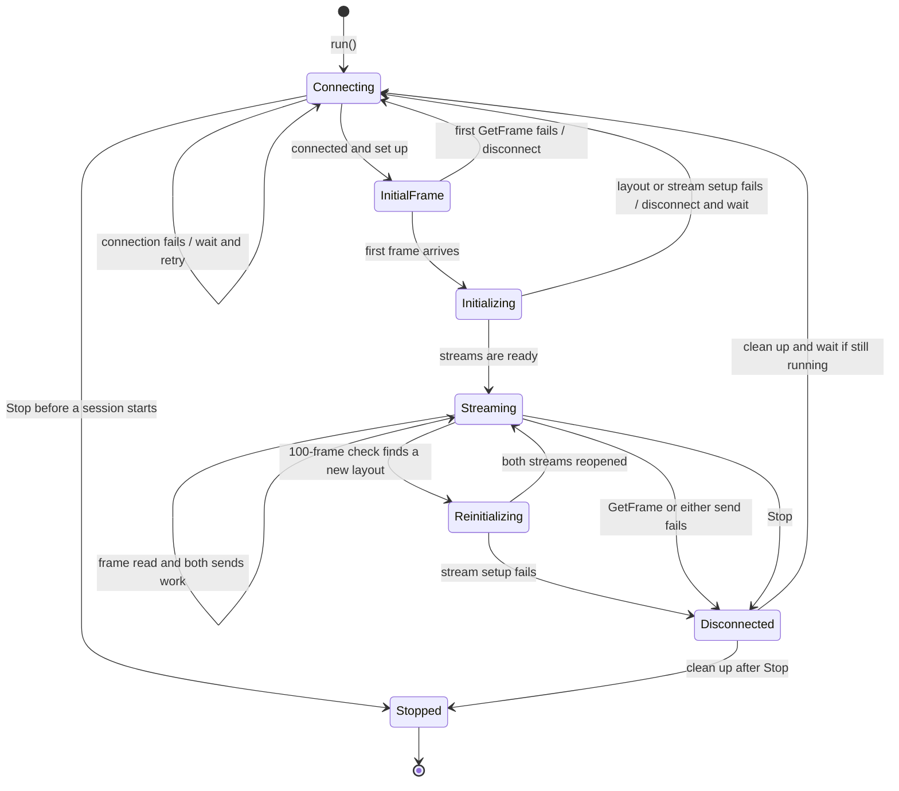
```mermaid
stateDiagram-v2
    [*] --> Connecting: run()
    Connecting --> Connecting: connection fails / wait and retry
    Connecting --> Stopped: Stop before a session starts
    Connecting --> InitialFrame: connected and set up
    InitialFrame --> Connecting: first GetFrame fails / disconnect
    InitialFrame --> Initializing: first frame arrives
    Initializing --> Connecting: layout or stream setup fails / disconnect and wait
    Initializing --> Streaming: streams are ready
    Streaming --> Streaming: frame read and both sends work
    Streaming --> Reinitializing: 100-frame check finds a new layout
    Reinitializing --> Streaming: both streams reopened
    Reinitializing --> Disconnected: stream setup fails
    Streaming --> Disconnected: GetFrame or either send fails
    Streaming --> Disconnected: Stop
    Disconnected --> Connecting: clean up and wait if still running
    Disconnected --> Stopped: clean up after Stop
    Stopped --> [*]
```

### Connect

1. `run()` makes one `ViconTimestampState` before the reconnect loop starts.
2. `connectWithRetry()` reports `Connecting` before the first try.
3. After a failed try, report how long it will wait, then wait in steps of no more than 100 ms.
4. Once connected, set `ServerPush` mode and turn on segment and marker data.
5. If any setup call fails, disconnect and count it as a failed connection.
6. If Stop comes in while connecting or waiting, close any connection that was made and report `Stopped`.

### Read the first frame and open streams

1. Read one Vicon frame before reading names or opening streams.
2. If this first `GetFrame` fails, report `Connecting` and disconnect. The first time, retry right away. If it keeps failing, wait the normal retry time. A good first frame resets this.
3. On success, update `frame_count_`.
4. Stop reading the layout at the first count or name that fails. Return no layout, along with the errors.
5. Only clear errors from an earlier session once the layout has been read.
6. Use the Vicon frame rate as the LSL expected rate only if it is positive and finite. Otherwise, use an irregular rate.
7. If the computer name cannot be read, use `default` in the source IDs.
8. Open the marker stream before the segment stream. If either throws an error, close both and report failure.
9. An empty layout counts as success and opens no LSL stream.

### Send frames

Each time round the streaming loop:

1. Read a frame. Leave the session if `GetFrame` fails.
2. Pick a finite timestamp that is later than the last one. If none can be made, skip the frame.
3. `buildViconFrame` reads every known marker and segment and returns their values, whether each read worked, and any errors. Each stream turns missing values into its own `NaN` sample.
4. Send markers first and segments second, with the same timestamp.
5. A hidden or failed item becomes a fixed-size "missing" value. It does not end the session.
6. If sending to either LSL stream fails, report that streams will be reopened and leave the session.
7. Group read errors after both sends.
8. After 100 times round the loop, reset the layout counter, report status, and read the layout again.

### Handle a layout check

- If reading the layout fails, report the error and keep the current streams.
- If the layout is the same, keep streaming.
- If it changed, close both streams before opening new ones.
- If opening the new ones fails, stop streaming and clean up fully.
- If it works, report that the streams were reopened.

### Clean up

In this order:

1. Close the marker stream.
2. Close the segment stream.
3. Disconnect from Vicon.
4. Reset the frame count, layout counter, known layout, grouped errors, and last error.
5. Report `Disconnected`.
6. If still running, wait and reconnect.
7. Otherwise, report `Stopped` and return.

Do not reset the timestamp record when reconnecting. Because source IDs stay the same and timestamps only go up, LabRecorder treats a reopened stream as the same stream coming back.

The run flag starts as true when the bridge is created. `run()` never sets it back to true. The desktop app makes a new bridge after every Stop.

### Bridge tests

- [ ] Stop before the first connection reports `Stopped` and returns quickly.
- [ ] Repeated connection failures wait for the chosen interval.
- [ ] A setup failure disconnects before retrying.
- [ ] A first-frame failure reconnects without publishing half a layout.
- [ ] The first first-frame failure in a row reconnects without waiting, and
      every later one waits the chosen interval.
- [ ] A layout read failure throws away partial names and waits before retrying.
- [ ] Empty marker, segment, or both layouts reach `Streaming` without opening extra streams.
- [ ] Hidden or failed reads send fixed-size "missing" values and keep streaming.
- [ ] If opening a stream throws, the other stream that was already opened is closed.
- [ ] A marker or segment send failure closes both streams and reconnects.
- [ ] Layout checks still happen every 100 frames.
- [ ] A layout read error keeps the current streams; a real change replaces both.
- [ ] Marker and segment samples from one frame share a timestamp.
- [ ] Timestamps keep going up after reconnecting when source IDs stay the same.
- [ ] Stopping a live session reports `Disconnected` before `Stopped`.

## Desktop window and bridge worker

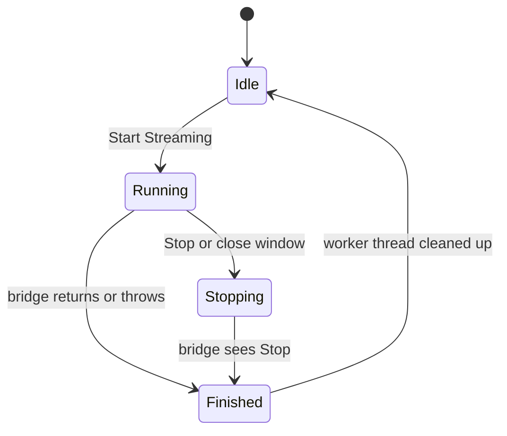
```mermaid
stateDiagram-v2
    [*] --> Idle
    Idle --> Running: Start Streaming
    Running --> Stopping: Stop or close window
    Running --> Finished: bridge returns or throws
    Stopping --> Finished: bridge sees Stop
    Finished --> Idle: worker thread cleaned up
```

- `BridgeWindow::onStart()` copies the server and both stream names into `Config`, saves them, locks the fields, creates one `BridgeWorker`, hooks up its signals, and starts it.
- The worker adds the bridge status callback inside `run()`.
- If the bridge throws, the worker sends `terminal(Failed, message)`.
- `onStop()` disables the Stop button and asks the bridge to stop. It does not delete the worker itself.
- `onWorkerFinished()` turns the controls back on, clears the rate and out-of-date status, schedules the thread for deletion, clears the pointer, and lets a waiting window close go ahead.

### Status age

- The rate the window shows is the change in frame number divided by the time between status messages.
- Normal status messages come with the 100-frame layout check, plus extra ones for state changes and errors.
- If no streaming status arrives for more than 3000 ms, mark it out of date once and show `0.0 Hz`.
- A new status clears that mark.

## LabRecorder remote connection

### Connection state

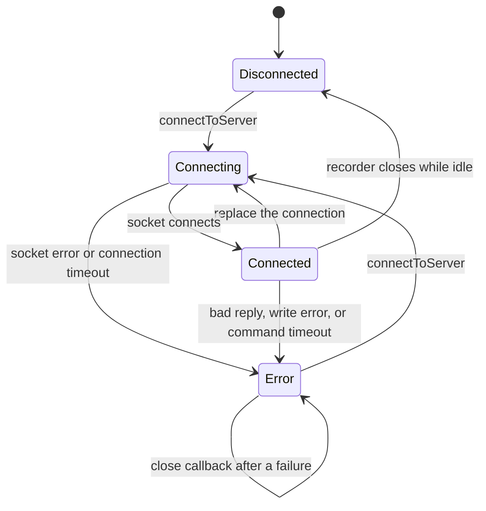
```mermaid
stateDiagram-v2
    [*] --> Disconnected
    Disconnected --> Connecting: connectToServer
    Error --> Connecting: connectToServer
    Connected --> Connecting: replace the connection
    Connecting --> Connected: socket connects
    Connecting --> Error: socket error or connection timeout
    Connected --> Error: bad reply, write error, or command timeout
    Connected --> Disconnected: recorder closes while idle
    Error --> Error: close callback after a failure
```

`connectToServer()` replaces the old connection:

1. Stop both timers.
2. End any work in progress as failed, because the connection was replaced.
3. Throw away unsent command data and partial replies.
4. Close the old connection straight away.
5. Store the connection and command timeouts separately.
6. Set the recording state to `Unknown`.
7. Set the connection state to `Connecting`, start connecting, and start the connection timer if it is still needed.

Once connected, the state is `Connected`. The recording state stays `Unknown` until this app gets a good reply to Start or Stop.

### Recording state

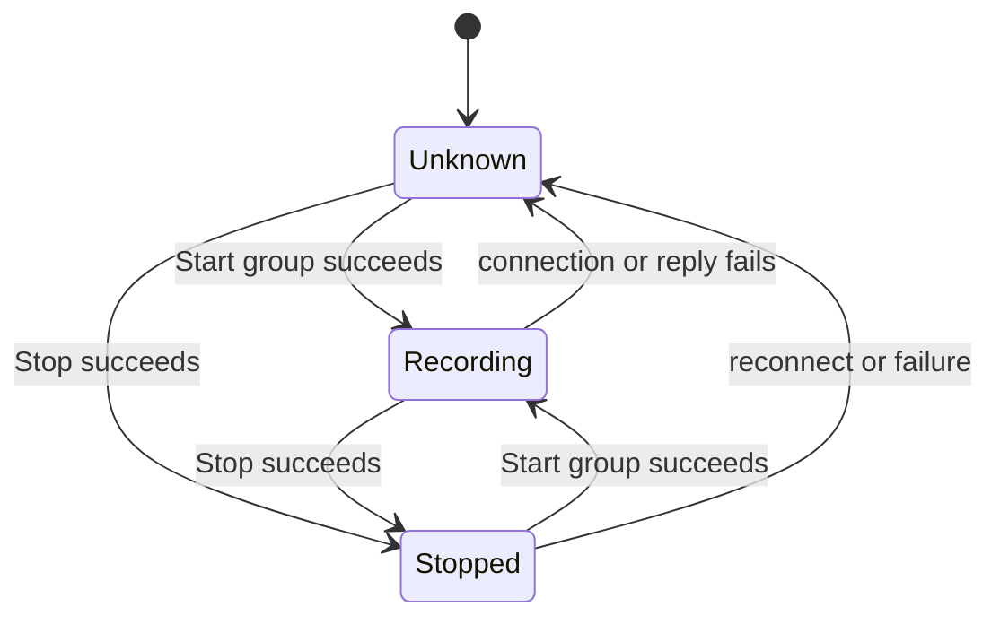
```mermaid
stateDiagram-v2
    [*] --> Unknown
    Unknown --> Recording: Start group succeeds
    Stopped --> Recording: Start group succeeds
    Unknown --> Stopped: Stop succeeds
    Recording --> Stopped: Stop succeeds
    Recording --> Unknown: connection or reply fails
    Stopped --> Unknown: reconnect or failure
```

The last confirmed state is only part of the picture. `LabRecorderClient` also
tracks the state it wants to reach and what it is doing right now:

- `Idle`
- `Refreshing`
- `UpdatingFilename`
- `Starting`
- `Stopping`
- `ShuttingDown`

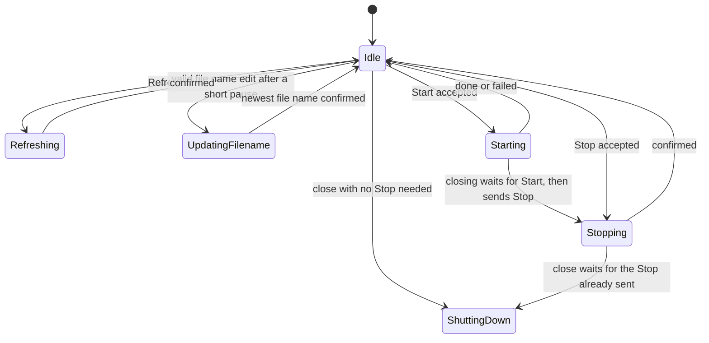
```mermaid
stateDiagram-v2
    [*] --> Idle
    Idle --> Refreshing: Refresh
    Idle --> UpdatingFilename: valid file name edit after a short pause
    Idle --> Starting: Start accepted
    Refreshing --> Idle: confirmed
    UpdatingFilename --> Idle: newest file name confirmed
    Starting --> Idle: done or failed
    Starting --> Stopping: closing waits for Start, then sends Stop
    Idle --> Stopping: Stop accepted
    Stopping --> Idle: confirmed
    Idle --> ShuttingDown: close with no Stop needed
    Stopping --> ShuttingDown: close waits for the Stop already sent
```

The buttons depend on the connection, confirmed state, wanted state, current
action, path check, and whether the window is closing, all together. Only one
command group can run at a time. A second Start or Stop, a refresh, or a file
name change is refused while a group is running.

While the confirmed state is `Unknown`, you can still Start or Stop to recover,
but only when connected and nothing else is running. The window always shows
`Starting`, `Recording`, `Stopping`, `Stopped`, or `Unknown`, and which command
number is waiting for a reply.

### Command groups

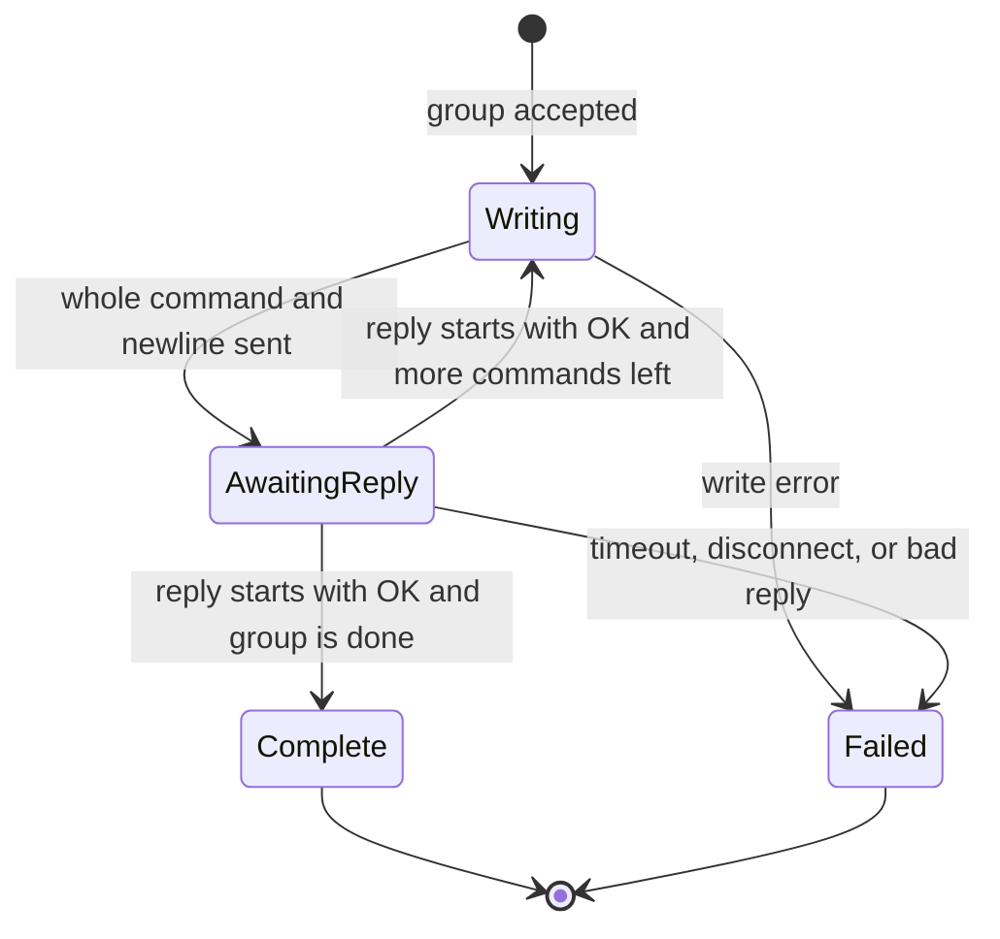
```mermaid
stateDiagram-v2
    [*] --> Writing: group accepted
    Writing --> AwaitingReply: whole command and newline sent
    AwaitingReply --> Writing: reply starts with OK and more commands left
    AwaitingReply --> Complete: reply starts with OK and group is done
    Writing --> Failed: write error
    AwaitingReply --> Failed: timeout, disconnect, or bad reply
    Complete --> [*]
    Failed --> [*]
```

Keep these rules:

- Only one group runs at a time.
- Only one command in that group waits for a reply.
- Keep any part of a command that has not been sent yet.
- Keep pieces of a reply until `OK` can be checked.
- Skip line breaks, spaces, and tabs at the start of a reply.
- The two letters `OK` are enough. Do not wait for the rest of the line.
- A failure ends the group and closes the connection.
- A successful group only changes the recording state if the group says which state it leads to (anything other than `Unknown`).
- In record-every-visible-stream mode, Start is one unbroken group: `update`, `select all`, `filename`, `start`.
- Closing while Start is running lets that group finish, then sends exactly one
  Stop. All new work is refused once closing begins.
- A timeout, bad reply, disconnect, or allowed connection replacement ends the
  work in progress as failed and sets both the confirmed and wanted state back
  to `Unknown`. Replacing the connection is refused while recording work is running
  on it. Reconnecting after the connection was lost remembers that Start may have
  reached the recorder, until Stop is confirmed.

### Start the bundled LabRecorder

1. Check the recorder address first. Never start a second copy if something already answers there.
2. Only start it if automatic start is on and nothing answers at that address.
3. Use the program the user picked if it is valid. Otherwise, look for `labrecorder/LabRecorder.exe` next to the desktop app.
4. Start it without freezing the window, running from the program's own folder.
   Its state is `External`, `Launching`, `OwnedRunning`, `OwnedExited`,
   `LaunchFailed`, or `Detached`.
5. Pass its output and errors into the event log, keeping at most 64 KiB of output and 4 KiB per line.
6. Try the remote connection every 250 ms, only while not connected and not connecting, for at most 15 seconds.
7. Disconnecting from a recorder someone else started never closes it. Detach
   leaves a recorder started here running and stops the app from closing it
   later.

On screen, these states read as plain words such as **External**, **Starting
here**, and **Started here**.

When you pick exact streams, the app starts the bundled `LabRecorderCLI` without
freezing the window. It passes one full output path and one search per chosen
stream. Each search uses the source ID when there is one, and otherwise the name
plus the computer it comes from. Pressing Stop sends Enter to the program. The
app owns this process and never mixes it up with a LabRecorder window someone
else started.

### LabRecorder tests

- [ ] Replacing a connection fails the work in progress.
- [ ] The connection timeout does not change the command timeout.
- [ ] A command sent in pieces, or an `OK` split across replies, moves forward by exactly one command.
- [ ] A bad reply closes the connection and reports at most its first 80 bytes.
- [ ] Start sends `update`, `select all`, `filename`, and `start` in that order.
- [ ] A timeout or disconnect stops every later command in the group.
- [ ] The recording state only changes after Start or Stop is confirmed.
- [ ] Pressing Start or Stop twice sends exactly one command.
- [ ] Closing during each Start command lets the group finish and then sends one
  final `stop`.
- [ ] Connection replacement, bad replies, disconnects, and the recorder exiting
  all leave a clear state and a way to recover.
- [ ] The app checks the address before starting a recorder. Finding a custom or
  bundled recorder, its working folder, limited output, detach, and the
  15-second limit all still work.

## Closing the desktop window

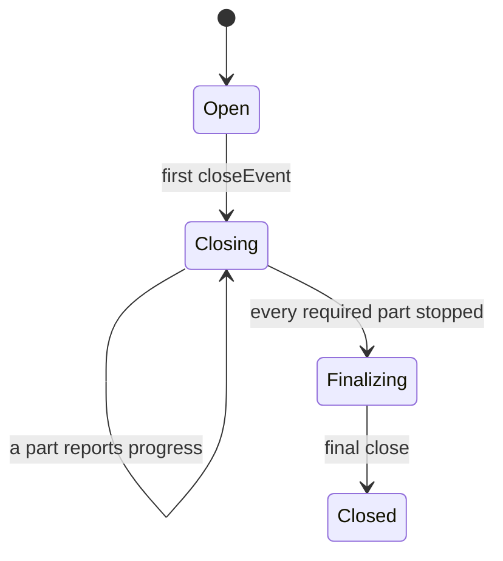
```mermaid
stateDiagram-v2
    [*] --> Open
    Open --> Closing: first closeEvent
    Closing --> Closing: closed again / show time left
    Closing --> Closing: a part reports progress
    Closing --> Finalizing: every required part stopped
    Finalizing --> Closed: final close
```

On the first close request:

- Enter `Closing` once and ignore further close requests.
- Refuse new Start, stream search, file name, and guided session work.
- Note which bridge, preview, file, stream search, file check, and recorder work
  must stop, and when each was asked to stop and must be done by.
- Call `LabRecorderClient::beginShutdown()`. If Start has not reached the `start` command yet, it cancels it. Otherwise it sets up or waits for one final Stop. A Stop already in progress is never sent twice.
- Ask the preview and bridge to stop without waiting, cancel file and stream
  work, and keep the window responsive.
- Check every 50 ms, only to update which part is still running and how much time
  is left. These checks never treat a running worker as gone.

The time limits shown are four seconds for the bridge, two seconds for the
preview and file work, and 15 seconds for the recorder. They report a delay; they
do not make the window wait. A Vicon call that cannot be cancelled may keep
running past four seconds. The window stays responsive and shows it until the
call returns. LSL stream searches wait at most 50 ms, stream detail reads at
most 250 ms, and sample reads never wait.

A recorder started by the app is only closed after the remote Stop is done or
the 15-second limit runs out. It gets one more second to close before the app
forces it. A recorder someone else started is never closed. If the remote
connection was already lost, an external recorder is marked done straight away
with `RecorderConnectionLost`, while a recorder started here waits for the time
limit.

Normal clean-up does not wait for running work. A worker that is still running
cleans itself up when it finishes. The backup clean-up waits at most two
seconds, then makes one last 100 ms try, but the normal close path never deletes
a running worker.

Normal work on the window thread should finish within 50 ms. A Stop request only
sets a cancel flag and returns. Clean-up for the Vicon SDK, LSL, files,
processes, and file checks happens off the window thread.

Test normal replies, each Start command, a Stop in progress, disconnects, the
rules for recorders started here or elsewhere, bridge connection and retry
delays, preview search and calibration, opening files, cancelled file checks,
and closing more than once.

## Preview

### Switch between live and recorded data

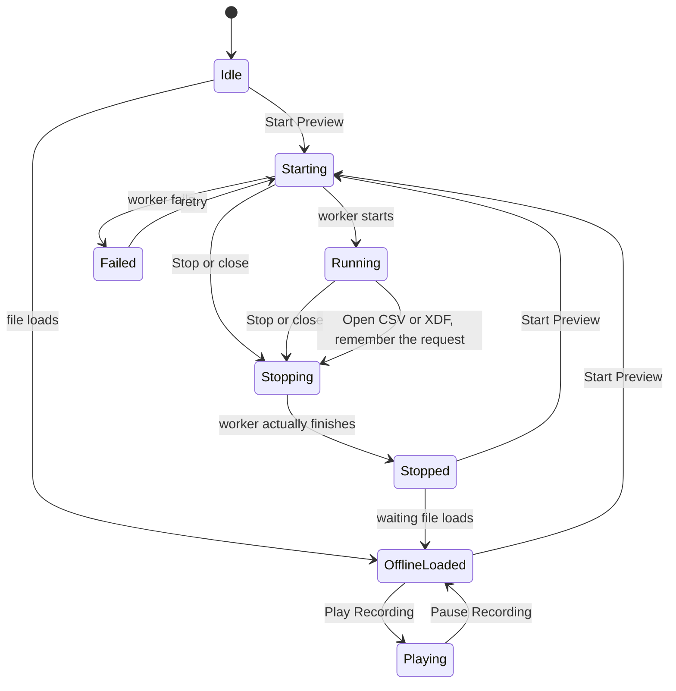
```mermaid
stateDiagram-v2
    [*] --> Idle
    Idle --> Starting: Start Preview
    Starting --> Running: worker starts
    Starting --> Stopping: Stop or close
    Running --> Stopping: Stop or close
    Running --> Stopping: Open CSV or XDF, remember the request
    Stopping --> Stopped: worker actually finishes
    Stopped --> Starting: Start Preview
    Idle --> OfflineLoaded: file loads
    Stopped --> OfflineLoaded: waiting file loads
    OfflineLoaded --> Playing: Play Recording
    Playing --> OfflineLoaded: Pause Recording
    OfflineLoaded --> Starting: Start Preview
    Starting --> Failed: worker fails
    Failed --> Starting: retry
```

- Starting the live preview stops playback, clears old trails, copies the chosen
  streams and settings into `PreviewWorkerConfig`, keeps one newest frame to
  draw, and starts a worker. Calibration only starts collecting when you select
  **Calibrate from Stair Target**.
- Stop only sets a cancel flag and returns within the normal 50 ms target. The
  panel stays in `Stopping`, with restart and file open turned off, until the
  worker has really ended. The two-second preview limit is just shown as a
  delay; it does not force a stop.
- Opening a CSV or XDF while live remembers one file, asks the worker to stop, and loads the file once `finished` arrives.
- After loading, CSV and XDF use the same playback storage and clock.
- Live drawing runs at 30 or 60 Hz and only uses the newest waiting frame.
  Stream rate, skipped older input, calibration samples, replaced display frames,
  and display delay are all counted separately.

### One live stream

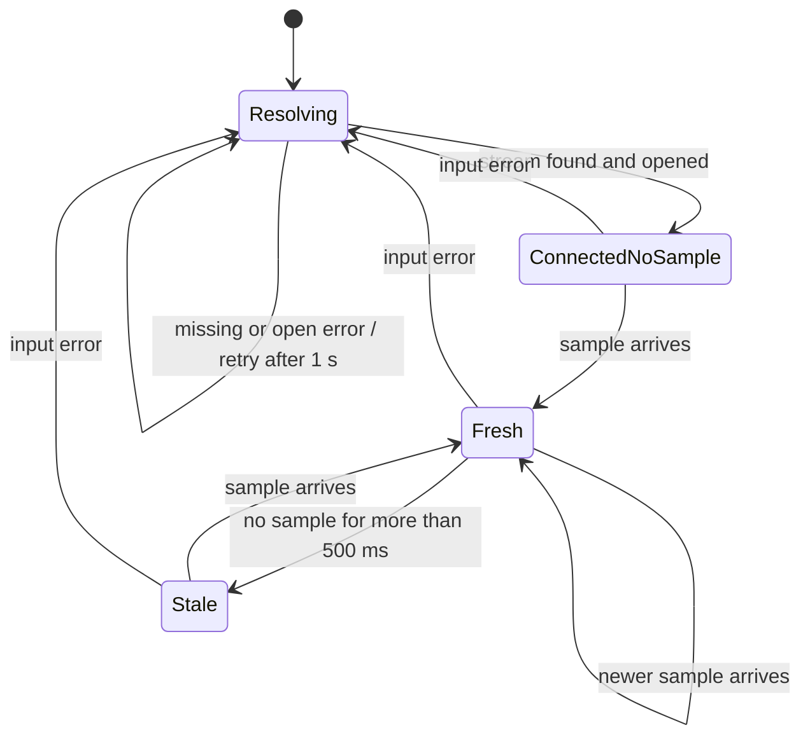
```mermaid
stateDiagram-v2
    [*] --> Resolving
    Resolving --> ConnectedNoSample: stream found and opened
    Resolving --> Resolving: missing or open error / retry after 1 s
    ConnectedNoSample --> Fresh: sample arrives
    Fresh --> Fresh: newer sample arrives
    Fresh --> Stale: no sample for more than 500 ms
    Stale --> Fresh: sample arrives
    ConnectedNoSample --> Resolving: input error
    Fresh --> Resolving: input error
    Stale --> Resolving: input error
```

Being connected and having recent data are not the same thing.
`PreviewFrame::*_stream_present` means an input is connected, even if it has no
sample yet or its last sample is old.

Finding a stream normally needs its saved source ID. If the same source shows up
several times after coming back, pick the one started most recently and say so.
A missing source ID never quietly turns into a match by name alone. **Follow by
name** allows a predictable match by name and reports duplicates or fallbacks.
Stream searches wait at most 50 ms, stream detail reads at most 250 ms, sample
reads never wait, and a missing stream is looked for again after one second.

### Load a recording and choose streams

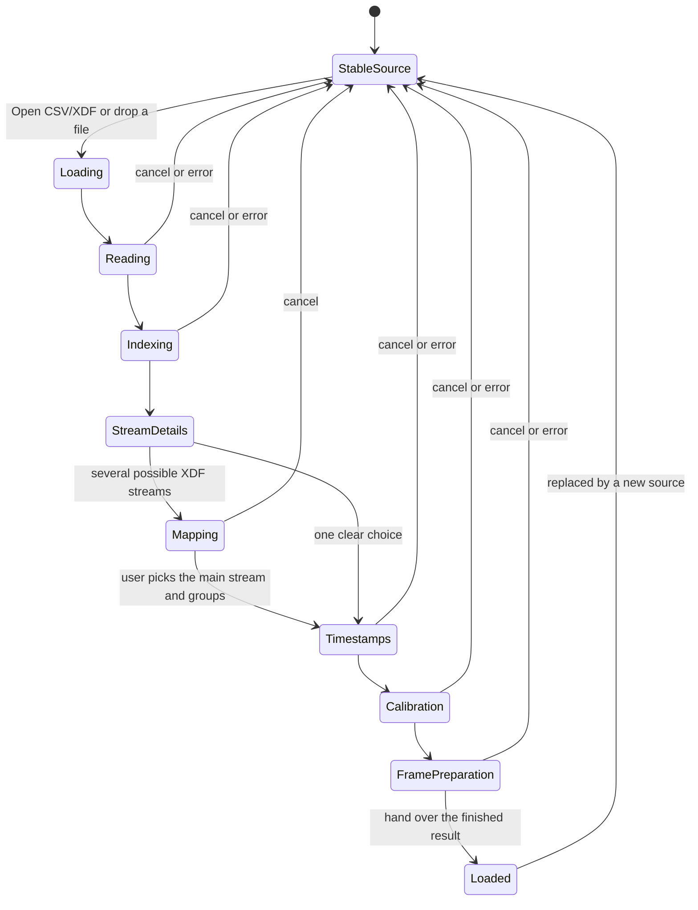
```mermaid
stateDiagram-v2
    [*] --> StableSource
    StableSource --> Loading: Open CSV/XDF or drop a file
    Loading --> Reading
    Reading --> Indexing
    Indexing --> StreamDetails
    StreamDetails --> Mapping: several possible XDF streams
    Mapping --> Timestamps: user picks the main stream and groups
    StreamDetails --> Timestamps: one clear choice
    Timestamps --> Calibration
    Calibration --> FramePreparation
    FramePreparation --> Loaded: hand over the finished result
    Reading --> StableSource: cancel or error
    Indexing --> StableSource: cancel or error
    Mapping --> StableSource: cancel
    Timestamps --> StableSource: cancel or error
    Calibration --> StableSource: cancel or error
    FramePreparation --> StableSource: cancel or error
    Loaded --> StableSource: replaced by a new source
```

The worker reads, indexes, gets stream details, fixes up times, chooses streams,
applies calibration, and prepares frames within the memory limit. It checks for
cancel after at most 1,024 lines, chunks, samples, or sample batches, and reports
progress at every step. The 250 ms cancel target includes time spent waiting for
the user to choose streams; cancelling ends that wait at once. A failure or
cancel keeps what was on screen before and never hands over half a recording.

Before building XDF frames, group candidate streams by role, source ID, name,
computer, and channel layout. Matching pieces are joined. If the same source ID
shows up on different computers, or one role has several clashing streams, the
user has to choose. That choice sets the main timeline and which streams are
included. The summary records the main ID, the chosen and left-out IDs, joined
pieces, time ranges, unmatched samples, and clock corrections. If no stream the
preview understands is found, loading fails instead of picking some unrelated
number stream.

Playback is `Loaded`, `Playing`, or `Paused`. Jumping updates the shared CSV/XDF
clock without changing speed. The user can also jump to the start or end, step
one frame or a set time, open recent files, drag and drop a file, and export the
current picture. At the end, playback stops when loop is off and wraps round
when loop is on. The memory limit caps the decoded result, and skipping frames
when drawing does not change the file check numbers.

### Stair alignment

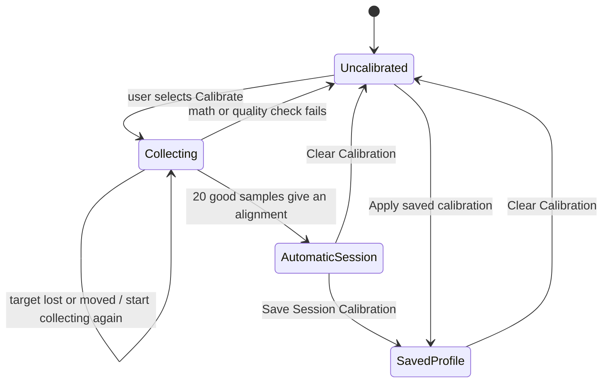
```mermaid
stateDiagram-v2
    [*] --> Uncalibrated
    Uncalibrated --> Collecting: user selects Calibrate
    Collecting --> Collecting: add a steady tracked position
    Collecting --> Collecting: target lost or moved / start collecting again
    Collecting --> Uncalibrated: math or quality check fails
    Collecting --> AutomaticSession: 20 good samples give an alignment
    AutomaticSession --> SavedProfile: Save Session Calibration
    AutomaticSession --> Uncalibrated: Clear Calibration
    SavedProfile --> Uncalibrated: Clear Calibration
    Uncalibrated --> SavedProfile: Apply saved calibration
```

`SavedProfile` is the name in the code; the screen shows **Saved calibration**.
`Uncalibrated` shows as **Not calibrated**. There is no typed-in alignment to fall
back on, so gaze is drawn as the HoloLens sent it until an alignment is worked out
or applied.

- Losing the target clears the collected positions.
- A position that moved too far from the first one starts collecting again from that new position.
- If coordinate details are missing or do not match, collecting pauses until the
  user confirms. Whether they match, and why a result was refused, stay visible.
- An automatic alignment stays in memory for this desktop session and is not
  saved unless the user saves it as a full calibration.
- Alignment changes reach the worker through a lock. The drawing area then fits the view again.
- Importing, exporting, **Copy**, **Hide**, editing the stair position, and
  **Apply** all keep the calibration's ID, version, setup, stair identity,
  coordinate names, notes, creation time, sample count, and position and angle
  error.
- Calibration progress is sent at most every 100 ms so the target stream cannot
  swamp the window.

## Check the setup and record a session

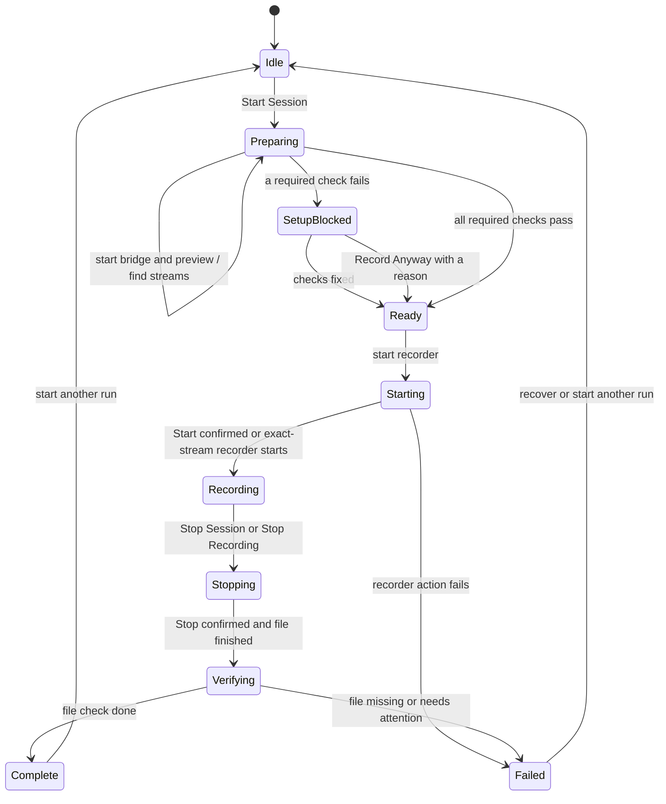
```mermaid
stateDiagram-v2
    [*] --> Idle
    Idle --> Preparing: Start Session
    Preparing --> Preparing: start bridge and preview / find streams
    Preparing --> SetupBlocked: a required check fails
    SetupBlocked --> Ready: checks fixed
    SetupBlocked --> Ready: Record Anyway with a reason
    Preparing --> Ready: all required checks pass
    Ready --> Starting: start recorder
    Starting --> Recording: Start confirmed or exact-stream recorder starts
    Starting --> Failed: recorder action fails
    Recording --> Stopping: Stop Session or Stop Recording
    Stopping --> Verifying: Stop confirmed and file finished
    Verifying --> Complete: file check done
    Verifying --> Failed: file missing or needs attention
    Failed --> Idle: recover or start another run
    Complete --> Idle: start another run
```

Setup items are `Required`, `Warning`, or `Information`. Required failures for
the bridge, recorder, path, chosen streams, sample age, and channel layout block
Start. Recorder-only mode turns the bridge requirement into information. Warnings
such as low free space, missing stream details, duplicate choices, or a low
expected rate stay visible but do not block. A blocked result can only be
skipped with a reason. Both the result and the reason go into the session log and
export.

The guided session starts the bridge, preview, stream search, setup check, and
recorder in that order, while every separate control stays available. Stopping
goes the other way: stop the recorder, wait for the file check, then stop the
preview and bridge. If only some steps finished, you can see which and stop each
one on its own.

## Check the file after recording

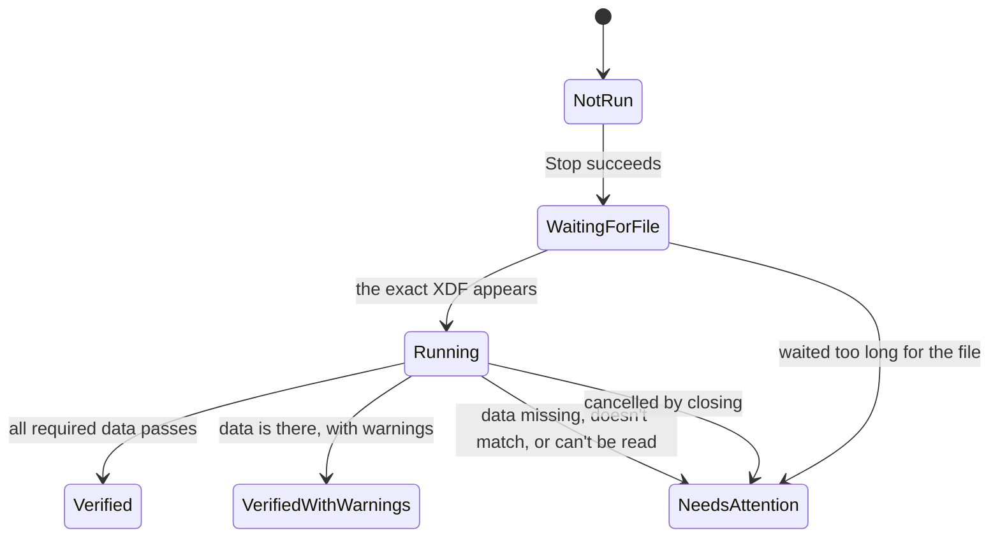
```mermaid
stateDiagram-v2
    [*] --> NotRun
    NotRun --> WaitingForFile: Stop succeeds
    WaitingForFile --> Running: the exact XDF appears
    WaitingForFile --> NeedsAttention: waited too long for the file
    Running --> Verified: all required data passes
    Running --> VerifiedWithWarnings: data is there, with warnings
    Running --> NeedsAttention: data missing, doesn't match, or can't be read
    Running --> NeedsAttention: cancelled by closing
```

This diagram uses the names from the code. On screen, `Verified` shows as
**Checked** and `VerifiedWithWarnings` as **Checked with warnings**.

The file check runs off the window thread and never changes the recording. It
compares the recorded streams with the list saved before Start, then reports the
source ID, channel layout, sample count, time range, length, measured rate, gaps,
clock corrections, repaired timestamps, and whether a cut-off file ending was
recovered. The report can be exported and links to playback. The automatic run
number increase only happens after the file exists and the chosen rule passes.

## HoloLens tracker and gaze reader

### Tracker life

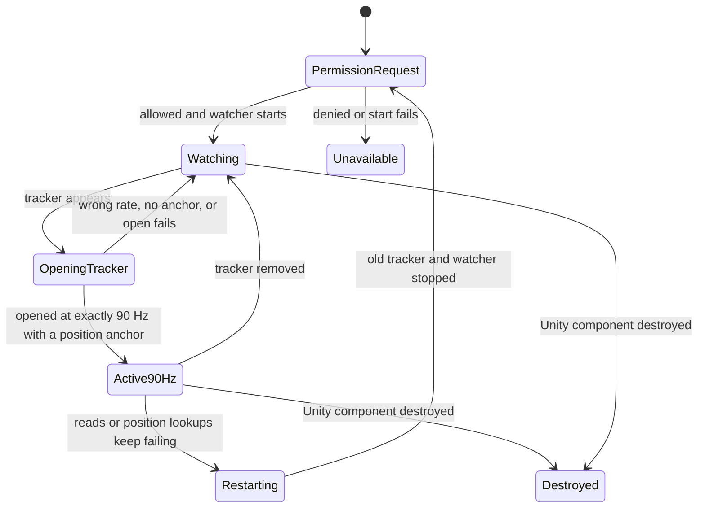
```mermaid
stateDiagram-v2
    [*] --> PermissionRequest
    PermissionRequest --> Watching: allowed and watcher starts
    PermissionRequest --> Unavailable: denied or start fails
    Watching --> OpeningTracker: tracker appears
    OpeningTracker --> Active90Hz: opened at exactly 90 Hz with a position anchor
    OpeningTracker --> Watching: wrong rate, no anchor, or open fails
    Active90Hz --> Watching: tracker removed
    Active90Hz --> Restarting: reads or position lookups keep failing
    Restarting --> PermissionRequest: old tracker and watcher stopped
    Active90Hz --> Destroyed: Unity component destroyed
    Watching --> Destroyed: Unity component destroyed
```

Four counters and checks keep old work out of a new session:

- `watcherGeneration` ignores a late reply from an older watcher.
- `trackerLifecycleGeneration` ignores a late `OpenAsync` reply after the tracker was removed or restarted.
- `sessionGeneration` tags each raw reading and tells the LSL output when the tracker session changes.
- Starting, removing, or restarting a tracker resets the reading-time check, empties both queues, and clears the position-lookup failure count.

### One gaze sample

Each time the publisher runs:

1. `TryGetNextSample` works through every reading made since the last accepted capture time, up to 32 per step, while holding the tracker lock. It does not ask until one frame period plus the measured delivery delay has passed since that capture. It stops once a reading brings it up to the newest reading the tracker has made. If there is no last capture time yet, or working through readings is paused, it asks for the reading at the current time instead.
2. Refuse a reading with a missing, repeated, out-of-order, or broken capture time. Refuse a reading fetched for the current time if it is old. An old reading found while working through earlier readings only means the step is catching up.
3. A read that fails inside the SDK does not hold back samples that are already converted and waiting. Send the waiting sample, and only report the failure once the queue is empty, so recovery still sees failures that keep happening. After three of the SDK's broken "nothing newer" results since reading last resumed, stop working through earlier readings for ten seconds. A good reading does not wipe that count.
4. Copy the combined ray, and the left and right rays if they are there, in tracker coordinates.
5. Add the raw reading, keeping the queue within 500 ms and 360 items.
6. Unity's `Update` handles at most 32 raw readings. For each, find where the headset was at the original capture time, move the rays into the world, and add a `GazeSample` to the next queue.
7. Before sending, if the converted queue is over its limit, keep only the newest item. Then take the oldest item left.

If looking up the headset position simply fails, still make a sample at the capture time, with the rays marked invalid. If it keeps throwing errors, restart the tracker. Never make up a new capture time.

## HoloLens LSL output

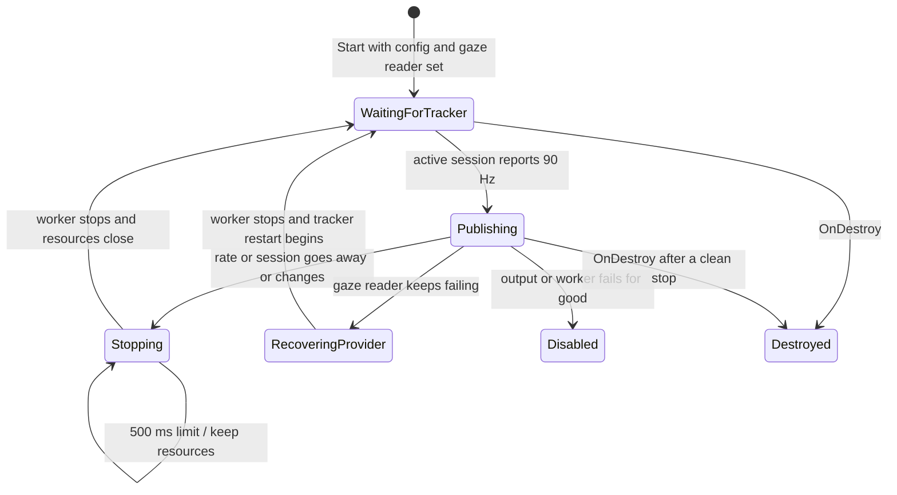
```mermaid
stateDiagram-v2
    [*] --> WaitingForTracker: Start with config and gaze reader set
    WaitingForTracker --> Publishing: active session reports 90 Hz
    Publishing --> Stopping: rate or session goes away or changes
    Publishing --> RecoveringProvider: gaze reader keeps failing
    Publishing --> Disabled: output or worker fails for good
    RecoveringProvider --> WaitingForTracker: worker stops and tracker restart begins
    Stopping --> WaitingForTracker: worker stops and resources close
    Stopping --> Stopping: 500 ms limit / keep resources
    WaitingForTracker --> Destroyed: OnDestroy
    Publishing --> Destroyed: OnDestroy after a clean stop
```

Keep these rules:

- Never replace or close the stream while the old worker might still send to it.
- If the worker does not stop within 500 ms, keep the worker and stream and try again on a later update.
- Short gaze reader errors do not replace the tracker. About one second of errors in a row starts recovery.
- Drop samples with bad capture times, but keep to the sending schedule.
- Treat an error from the LSL output as a permanent worker failure.
- When reopening the stream, use the saved name, type, source ID, and current expected rate.

The stair target output is simpler. It checks that it has a config and a model target, opens one stream, and sends in every `LateUpdate`. An error while opening or sending turns it off. Destroying it lets go of its stream.

### Device tests

- [ ] Denied permission leaves no half-made stream.
- [ ] A tracker that cannot do exactly 90 Hz never starts sending.
- [ ] A late `OpenAsync` reply from an old session cannot replace the current tracker.
- [ ] Removing the tracker empties both queues and blocks samples from the old session.
- [ ] Short gaze reader errors do not restart the tracker straight away.
- [ ] Errors that keep going stop the worker before the tracker restarts.
- [ ] If the worker takes too long to stop, the output stays open until the worker ends.
- [ ] A reopened stream keeps its identity and never sends an earlier timestamp.
- [ ] Destroying the component stops the watcher, tracker, and worker before letting go of anything else.

Use the [hardware test guide](device-parity-runbook.md) to collect results from the device.

## Main source files

- `vicon-lsl-bridge/src/ViconLSLBridge.cpp`
- `vicon-lsl-bridge/src/ViconClient.cpp`
- `vicon-lsl-bridge/src/ViconFrameMapper.*`
- `vicon-lsl-bridge/src/gui/BridgeWindow.*`
- `vicon-lsl-bridge/src/gui/LabRecorderClient.*`
- `vicon-lsl-bridge/src/gui/RecorderProcessController.*`
- `vicon-lsl-bridge/src/gui/PreviewPanel.*`
- `vicon-lsl-bridge/src/gui/PreviewStreamWorker.*`
- `hololens-gaze-lsl/Assets/Scripts/GazeDataProvider.cs`
- `hololens-gaze-lsl/Assets/Scripts/GazePublisherWorker.cs`
- `hololens-gaze-lsl/Assets/Scripts/GazeLSLOutlet.cs`
- `hololens-gaze-lsl/Assets/Scripts/VuforiaModelTargetPoseOutlet.cs`
- State and recovery tests under `vicon-lsl-bridge/tests` and `hololens-gaze-lsl/Tests`
